# 리눅스 서버 상태 점검 자동화 수행 내역서

- 미션: 컴퓨터가 알아서 자기 상태를 점검하게 만들기
- 수행일: 2026-10-08 (대한민국 시간)
- 실습 환경: WSL2 / Ubuntu 22.04.5 LTS / x86-64 / systemd
- 제출물: 이 수행 내역서와 별도 파일 `monitor.sh`
- 범위: 필수 과제. 보너스 통계 리포트 및 7일 압축·30일 삭제 정책은 제외한다.

> 이 문서는 대화에서 사용자가 실행하고 결과를 공유한 내용과 제공한 기존 소스코드를 바탕으로 작성했다. 기존 환경에 이미 존재하던 계정·그룹·보안 설정·스크립트를 점검하고, 실행 환경의 불일치를 수정한 뒤 기능을 검증했다. 계정 생성이나 스크립트 최초 작성을 이번 실습에서 새로 수행했다고 기록하지 않는다.
>
> 사용자가 이 대화에 보내 준 캡처를 내용 변경 없이 captures 폴더에 저장하고, 해당 항목에 상대 경로로 연결했다. 교체 요청이 있었던 ACL 사진은 최신 사진을 사용했다. 문서를 옮길 때는 captures 폴더도 함께 옮긴다.
>
> 최종 보완 항목: 최신 앱 시작 사진에서 Boot 5단계의 `[OK]`는 확인했으나, 사진 하단에 `Agent READY`가 보이지 않는다. 해당 문구가 보이는 캡처를 추가한 뒤 제출한다.

## 1. 과제 목적과 전체 흐름

리눅스 서버에 필요한 접속 보안과 역할별 접근 권한을 구성하고, 제공 앱의 상태와 시스템 자원 사용량을 Bash 스크립트로 점검·기록한다. cron으로 점검을 매분 실행하고, 로그의 용량과 보관 개수를 제한해 지속적으로 운영할 수 있게 한다.

```text
접속 보안 확인 → 계정·디렉토리 권한 확인 → 앱 실행 환경 구성
→ 앱 시작·포트 확인 → 상태 점검·로그 기록 → cron 자동 실행 → 로그 용량 관리
```

서비스가 동작하는지뿐 아니라, 명령을 선택한 이유와 권한 정책, 장애 상황의 확인 순서까지 설명하는 것을 목표로 한다.

## 2. 실습 환경과 도구 준비

### 2.1 환경 확인

```bash
cat /etc/os-release
uname -m
whoami
ps -p 1 -o comm=
uname -r
```

| 항목 | 확인 결과 |
| --- | --- |
| 배포판 | Ubuntu 22.04.5 LTS (Jammy) |
| CPU 구조 | x86_64 |
| 최초 작업 계정 | skgun00 |
| PID 1 | systemd |
| 커널 | 6.6.114.1-microsoft-standard-WSL2 |

앱 실행 계정은 이후 `agent-admin`으로 전환했다.

### 2.2 준비 명령

```bash
sudo apt update
sudo apt -o Acquire::ForceIPv4=true install -y openssh-server ufw acl cron logrotate
```

저장소 연결 대기가 발생했을 때 IPv4 연결과 제한된 대기 시간을 적용하는 다음 명령을 안내했고, 사용자는 패키지 목록 갱신 완료 결과를 공유했다.

```bash
sudo apt \
  -o Acquire::ForceIPv4=true \
  -o Acquire::http::Timeout=20 \
  -o Acquire::https::Timeout=20 \
  -o Acquire::Retries=0 \
  update
```

SSH와 cron은 `active` 상태였으며, UFW와 ACL 확인 명령도 실행됐다. 로그 용량 관리는 logrotate 설정 대신 기존 `monitor.sh`의 직접 순환 로직을 사용했다.

## 3. SSH 및 방화벽 확인

### 3.1 SSH 설정과 실제 동작

```bash
sudo /usr/sbin/sshd -t && echo "SSH 설정 문법 정상"
sudo /usr/sbin/sshd -T | grep -E '^(port|permitrootlogin) '
sudo ss -ltnp | grep sshd
```

확인 결과:

```text
SSH 설정 문법 정상
port 20022
permitrootlogin no
```

`sshd`가 IPv4 `0.0.0.0:20022`와 IPv6 `[::]:20022`에서 LISTEN 중인 것을 확인했다.

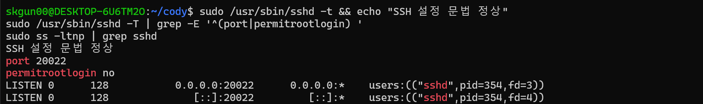

*캡처 2 — SSH 문법 검사·실제 설정·LISTEN 확인*

설정 파일의 문법 검사, 해석된 설정값, 실행 중인 서비스의 포트를 함께 확인했다. 포트 변경은 기본 22번을 대상으로 하는 단순 자동 스캔을 줄이는 보조 조치이며, 인증 보안을 대신하지 않는다. Root 원격 로그인 차단은 원격 접속 단계에서 최고 관리자 권한을 바로 얻는 경로를 제한한다. 일반 계정으로 접속하고 필요한 관리 작업에만 sudo를 사용한다.

### 3.2 UFW 상태와 허용 규칙

```bash
sudo ufw status verbose
```

| 항목 | 결과 |
| --- | --- |
| 상태 | active |
| 기본 인바운드 정책 | deny |
| 기본 아웃바운드 정책 | allow |
| 허용 TCP 포트 | 20022, 15034 |
| IPv6 | 같은 두 포트에 대한 허용 규칙 존재 |

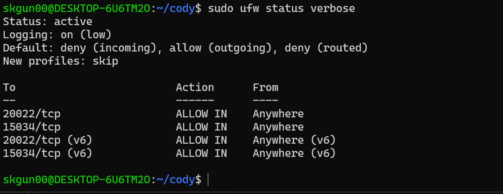

*캡처 1 — UFW 활성화·기본 정책·허용 포트*

들어오는 연결을 기본적으로 차단하고 SSH 관리와 앱 서비스에 필요한 두 포트만 허용했다. `ss`에 나타나는 LISTEN 소켓과 방화벽의 허용 규칙은 서로 다른 정보다.

## 4. 계정·그룹·디렉토리 권한

### 4.1 역할별 그룹 구성

```bash
id agent-admin
id agent-dev
id agent-test
getent group agent-common agent-core
```

| 계정 | UID | agent-common | agent-core | 역할 |
| --- | --- | --- | --- | --- |
| agent-admin | 1001 | 포함 | 포함 | 운영·앱 실행·cron 실행 |
| agent-dev | 1002 | 포함 | 포함 | 개발·스크립트 관리 |
| agent-test | 1003 | 포함 | 제외 | QA·테스트 |

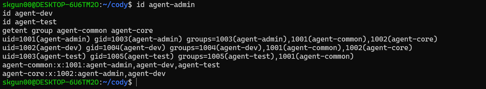

*캡처 3 — 계정과 그룹 구성*

각 계정의 개인 기본 그룹 외에, 업무별 접근 권한을 공용 그룹 두 개로 구분했다.

### 4.2 디렉토리와 ACL

```bash
sudo ls -ld \
  /home/agent-admin \
  /home/agent-admin/agent-app \
  /home/agent-admin/agent-app/upload_files \
  /home/agent-admin/agent-app/api_keys \
  /var/log/agent-app

sudo getfacl -p \
  /home/agent-admin \
  /home/agent-admin/agent-app \
  /home/agent-admin/agent-app/upload_files \
  /home/agent-admin/agent-app/api_keys \
  /var/log/agent-app
```

| 경로 | 소유 그룹 | 주요 정책 |
| --- | --- | --- |
| /home/agent-admin | agent-admin | ACL로 agent-common에 경로 통과 권한 부여 |
| /home/agent-admin/agent-app | agent-common | 그룹 읽기·경로 통과 허용 |
| upload_files | agent-common | 세 계정에 읽기·쓰기·경로 통과 허용 |
| api_keys | agent-core | 운영자·개발자에 읽기·쓰기·경로 통과 허용 |
| /var/log/agent-app | agent-core | 운영자·개발자에 읽기·쓰기·경로 통과 허용 |

상위 홈 디렉토리에는 `group:agent-common:--x` ACL이 있었다. 공용 그룹에 홈 폴더 목록 조회 권한을 주지 않고, 알고 있는 하위 경로로 통과할 수 있도록 한 구성이다.

디렉토리의 `r`은 목록 조회, `w`는 항목 생성·삭제, `x`는 경로 통과 권한이다. 그룹 권한에 있는 setgid(`s`)는 새 항목의 그룹 상속에 사용된다. 기본 ACL(`default:`)은 새 항목의 접근 권한 규칙을 물려주는 데 사용된다. 파일 생성 시 요청한 모드나 이후 chmod에 따라 최종 권한이 제한될 수 있으므로, 그룹 상속과 권한 상속은 구분해야 한다.

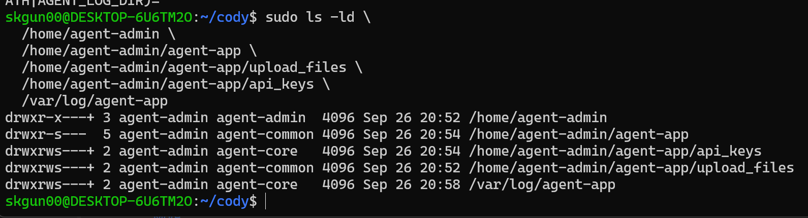

*캡처 4-1 — 디렉토리 소유자·그룹·권한*

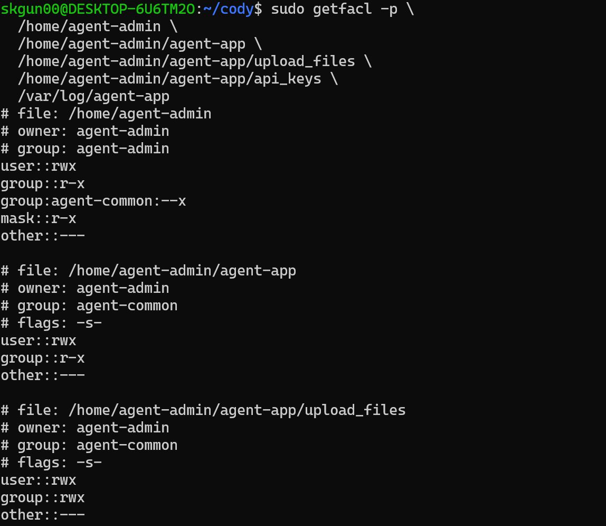

*캡처 4-2(1) — 상위 홈·앱·업로드 디렉토리 ACL*

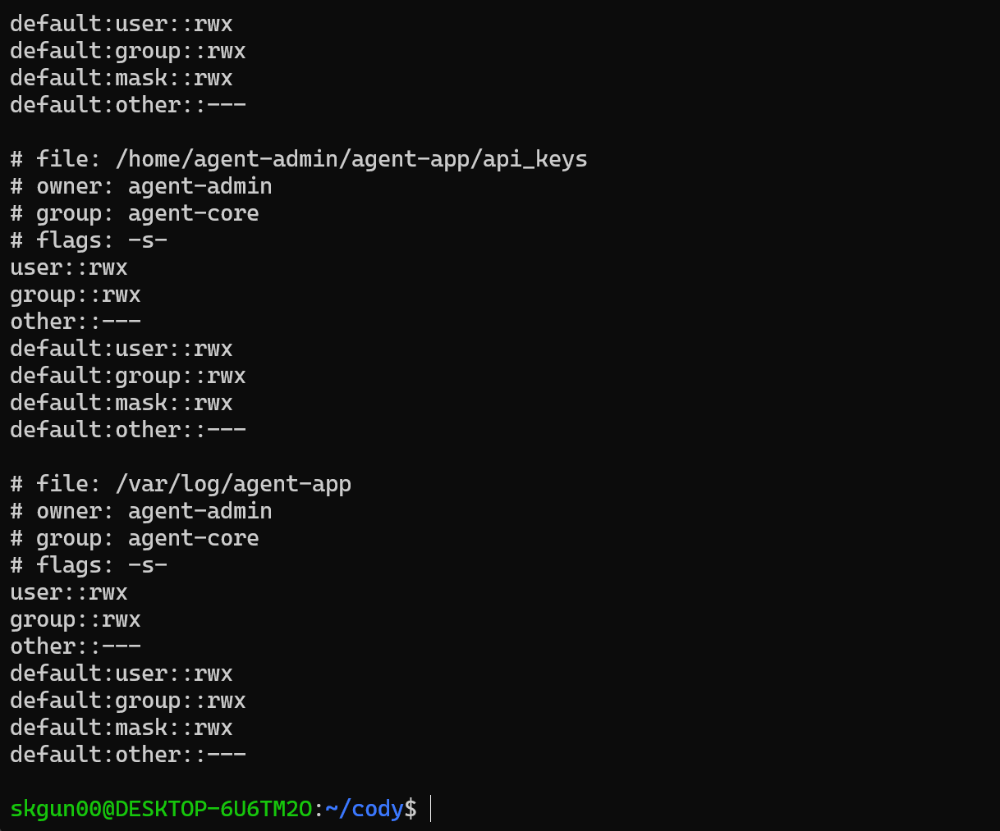

*캡처 4-2(2) — 키·로그 ACL 및 기본 ACL. 사용자가 교체해 준 사진*

### 4.3 실제 계정별 접근 확인

각 계정 권한으로 `test -r`, `test -w`, `test -x`를 실행했다. 파일을 만들거나 기존 권한을 변경하지 않고 접근 가능 여부를 검사했다.

| 계정 | upload_files | api_keys | 로그 디렉토리 |
| --- | --- | --- | --- |
| agent-admin | rwx | rwx | rwx |
| agent-dev | rwx | rwx | rwx |
| agent-test | rwx | --- | --- |

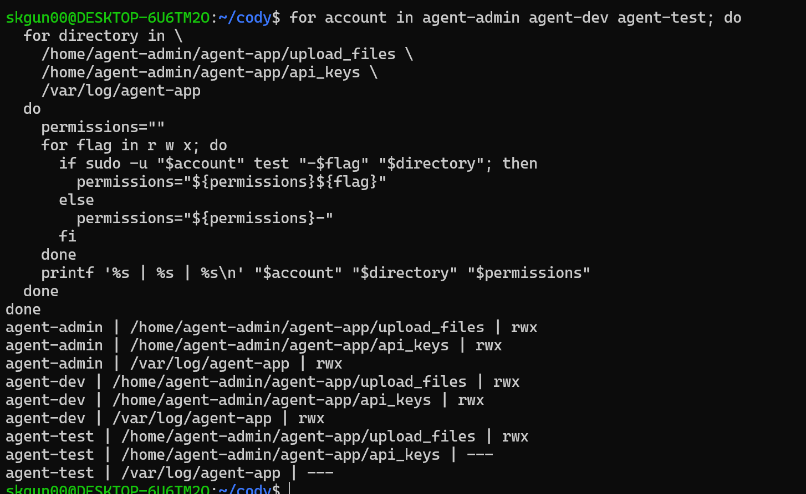

*캡처 4-3 — 실제 계정별 접근 권한 9개 검사*

계정·그룹 목록뿐 아니라 실제 접근 가능 여부까지 검증했다. 테스트 계정에 업로드 권한을 허용하면서 API 키와 운영 로그 접근을 제한하는 최소 권한 정책을 확인했다.

## 5. 앱 실행 환경과 오류 해결

### 5.1 환경 변수와 실행 계정

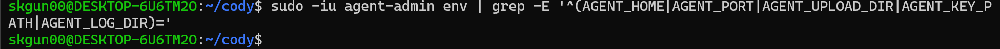

*초기 환경 확인 — agent-admin 로그인 환경에서 AGENT 변수가 출력되지 않은 상태*

```bash
sudo -iu agent-admin
```

앱은 일반 계정 `agent-admin`으로 실행했다. 최종 공용 환경 설정 파일 `/home/agent-admin/agent-app/agent-env.sh`의 값은 다음과 같다.

```bash
export AGENT_HOME=/home/agent-admin/agent-app
export AGENT_PORT=15034
export AGENT_UPLOAD_DIR=/home/agent-admin/agent-app/upload_files
export AGENT_KEY_PATH=/home/agent-admin/agent-app/api_keys
export AGENT_LOG_DIR=/var/log/agent-app
export AGENT_APP_PATH=/home/agent-admin/agent-app/agent-app-linux-x86
```

`AGENT_APP_PATH`는 기존 모니터에서 프로세스 식별에 사용하는 추가 설정이다. 키 파일의 실제 위치는 `/home/agent-admin/agent-app/api_keys/t_secret.key`이다. 요구되는 테스트 키 문자열은 `agent_api_key_test`이며, 앱의 Required Files 검사에서 올바른 키 문자열임을 확인했다.

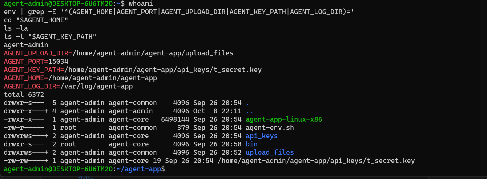

*캡처 5-1 — 초기 실행 계정·환경 변수·앱 및 키 파일. 키 경로의 최종 수정은 다음 항목에서 확인*

### 5.2 AGENT_KEY_PATH 불일치 해결

PDF는 `AGENT_KEY_PATH`를 키 파일 전체 경로로 지정하도록 안내했다. 처음 해당 값을 적용했을 때 제공 실행파일은 다음 메시지로 시작 검사에 실패했다.

```text
[2/5] Verifying Environment Variables [FAIL]
Key Path Mismatch. Expected: /home/agent-admin/agent-app/api_keys
```

3~5단계는 이전 치명적 실패 때문에 검사를 건너뛴 것으로 출력됐다. 이를 독립적인 파일·포트·로그 장애로 판단하지 않았다.

앱이 요구하는 디렉토리 경로로 현재 셸과 공용 설정 파일을 수정했다.

```bash
export AGENT_KEY_PATH="$AGENT_HOME/api_keys"
```

`skgun00` 계정에서 공용 파일을 수정한 명령:

```bash
sudo sed -i \
  's|^export AGENT_KEY_PATH=.*$|export AGENT_KEY_PATH=/home/agent-admin/agent-app/api_keys|' \
  /home/agent-admin/agent-app/agent-env.sh
sudo grep '^export AGENT_KEY_PATH=' /home/agent-admin/agent-app/agent-env.sh
```

키 파일 위치를 변경하지 않고 환경 변수 값만 수정했다.

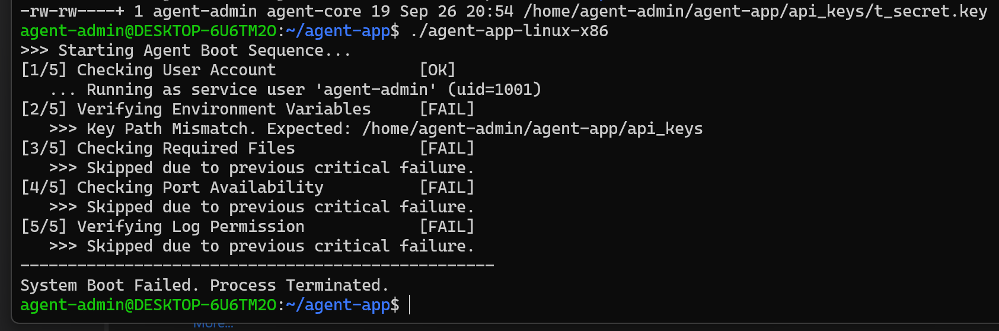

*오류 해결(1) — 키 파일 경로를 지정했을 때 시작 검사 실패*

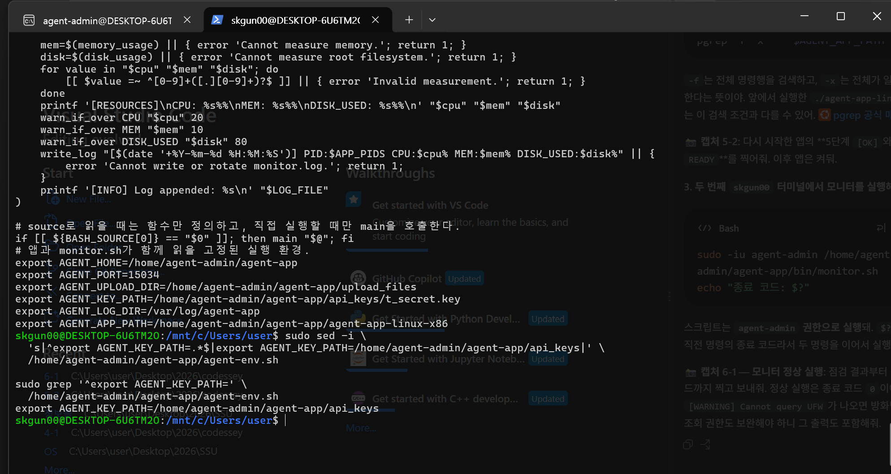

*오류 해결(2) — 공용 환경 설정 파일의 AGENT_KEY_PATH를 디렉토리로 수정한 결과*

### 5.3 시작 검사와 LISTEN 확인

최신 앱 시작 캡처에서 다음 5단계 모두 `[OK]`를 확인했다.

1. 일반 실행 계정 확인: agent-admin, UID 1001.
2. 환경 변수 확인.
3. 필요한 파일 및 키 문자열 확인.
4. 포트 15034 사용 가능 여부 확인.
5. 로그 디렉토리 쓰기 권한 확인.

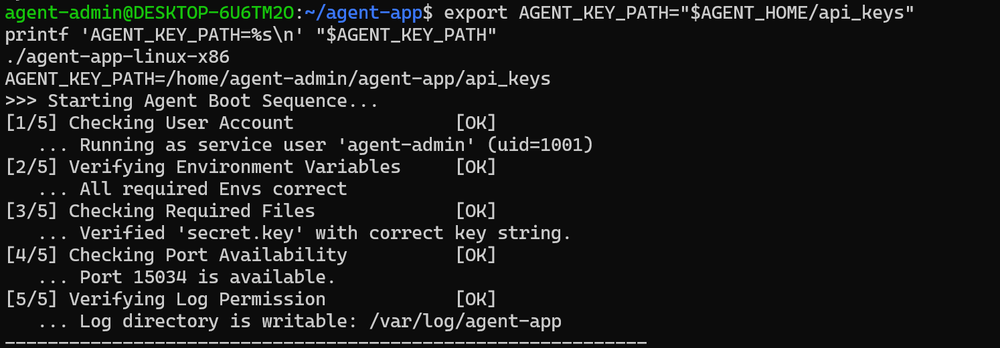

*캡처 5-2 — 수정된 키 경로로 Boot 5단계 모두 OK. 사진에 Agent READY 문구는 포함되지 않음*

앱은 실행 중 자체 INFO 로그를 계속 출력하고 CPU 작업·메모리 할당 정보를 알렸다. 이 화면 출력과 `monitor.sh`가 기록하는 `monitor.log`는 구분했다.

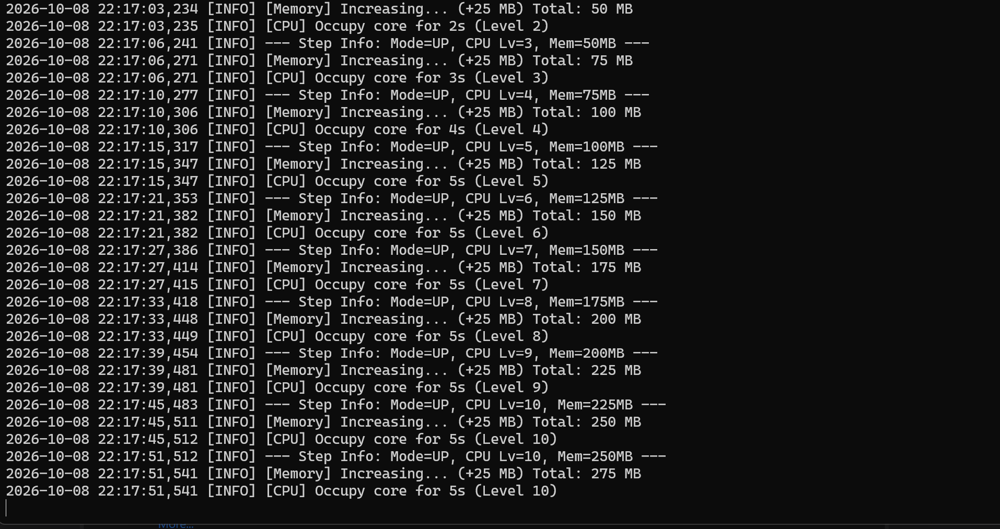

*앱 동작 참고 — CPU 작업·메모리 할당에 대한 자체 INFO 로그*

다른 터미널에서 실제 포트를 확인했다.

```bash
ss -ltn '( sport = :15034 )'
```

확인 결과: `0.0.0.0:15034`에서 LISTEN 중이었다.

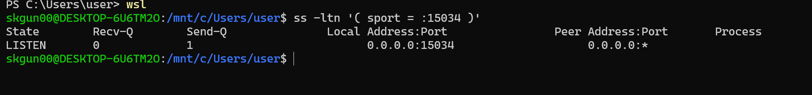

*캡처 5-3 — 0.0.0.0:15034 LISTEN 확인*

이 결과는 앱의 로컬 수신 상태를 확인한 것이다. 다른 기기에서 WSL로 접근하는 외부 연결 시험은 이번 기록에 포함하지 않았다.

### 5.4 모니터와 일치하는 실행 방식

기존 모니터는 절대 경로와 명령행 전체가 일치하는 앱 프로세스를 검색한다. 따라서 이후 앱을 다음과 같이 실행했다.

```bash
source /home/agent-admin/agent-app/agent-env.sh
"$AGENT_APP_PATH"
```

`./agent-app-linux-x86`로 실행한 명령행과 절대 경로로 실행한 명령행은 다를 수 있다. 프로세스 검색 조건과 실행 방식을 일치시킨 뒤 모니터의 정상 동작을 확인했다.

앱 종료는 앱 터미널에서 Ctrl+C로 수행한다. 앱을 켜둔 상태의 추가 확인은 두 번째 터미널에서 진행했다.

## 6. monitor.sh 구조와 권한

### 6.1 운영 원본과 제출 복사본

| 항목 | 운영 원본 |
| --- | --- |
| 경로 | /home/agent-admin/agent-app/bin/monitor.sh |
| 소유자 | agent-dev |
| 그룹 | agent-core |
| 권한 | 750 (rwxr-x---) |
| 실제 점검 실행 계정 | agent-admin |
| 크기 | 5,932바이트 |

`agent-dev`는 소유자 권한으로 스크립트를 관리하고, `agent-admin`은 agent-core 그룹의 읽기·실행 권한으로 실행한다. 테스트 계정은 원본 스크립트에 접근할 수 없다.

사용자가 만든 제출 복사본은 `/home/skgun00/cody/submission/monitor.sh`이며, 소유자는 skgun00, 권한은 644였다. 제출 복사본의 권한과 운영 원본의 권한은 각각의 목적에 따른다.

### 6.2 기능별 구현과 선택 이유

| 기능 | 구현 | 선택 이유 |
| --- | --- | --- |
| 프로세스 식별 | pgrep -f -x | 명령행 전체를 절대 경로와 일치시키고 단순 부분 문자열 오인을 줄임 |
| 포트 확인 | ss -H -ltnp, 지정 포트 필터 | TCP LISTEN 상태와 소유 PID를 함께 확인 |
| 프로세스·포트 관계 | 앱 PID와 ss의 PID 비교 | 다른 프로그램이 포트를 차지한 경우를 구분 |
| 방화벽 상태 | sudo -n /usr/sbin/ufw status | 비대화형 cron에서 허용된 조회 명령만 실행 |
| CPU | /proc/stat, awk, 1초 샘플링 | 누적 CPU 시간의 변화량으로 사용률 계산 |
| 메모리 | /proc/meminfo의 MemTotal·MemAvailable | 사용 가능 메모리를 기준으로 시스템 사용률 계산 |
| 루트 디스크 | df -P /, awk | 일정한 출력 형식에서 루트 파일시스템 사용률 추출 |
| 경고 비교 | awk의 소수 비교 | 소수점 사용률을 임계값과 비교 |
| 로그 추가 | printf와 >> | 기존 기록 유지 |
| 로그 순환 | stat, mv, rm | 다음 기록을 추가하기 전에 크기와 파일 개수 관리 |
| 중복 실행 방지 | flock | 수동 실행과 cron이 겹칠 때 로그 쓰기·순환 충돌 방지 |

CPU는 전체 누적 시간에서 idle+iowait를 유휴 시간으로 취급해 두 시점의 변화량으로 계산한다. guest 항목은 중복 합산하지 않는다.

```text
CPU(%) = (전체 시간 변화량 - 유휴 시간 변화량) / 전체 시간 변화량 × 100
MEM(%) = (MemTotal - MemAvailable) / MemTotal × 100
DISK_USED(%) = df -P /에서 추출한 Used %
```

수집 값은 앱 단독 사용률이 아니라 WSL 리눅스 환경 전체의 사용률이다. `LC_ALL=C`로 숫자와 명령 출력의 언어를 일정하게 하고, 필요한 PATH를 지정해 cron 실행 환경에서도 동작하도록 구성했다.

### 6.3 실패와 경고의 구분

| 조건 | 처리 |
| --- | --- |
| 앱 프로세스 없음 | 오류 출력, 종료 코드 1 |
| TCP 15034 LISTEN 없음 | 오류 출력, 종료 코드 1 |
| 포트가 앱 소유가 아님 또는 PID를 읽을 수 없음 | 오류 출력, 종료 코드 1 |
| 방화벽 비활성·조회 실패 | WARNING, 계속 진행 |
| CPU > 20% | WARNING, 계속 진행 |
| MEM > 10% | WARNING, 계속 진행 |
| DISK_USED > 80% | WARNING, 계속 진행 |

임계값과 같은 값은 초과가 아니므로 경고 대상이 아니다. 자원 수집·로그 쓰기 자체의 오류는 성공으로 처리하지 않는다.

로그 형식:

```text
[YYYY-MM-DD HH:MM:SS] PID:... CPU:..% MEM:..% DISK_USED:..%
```

시간과 필드 이름을 고정해 비교·파싱하기 쉽게 했다. `>`는 기존 파일 내용을 덮어쓰고, `>>`는 뒤에 추가하므로 누적 로그에는 `>>`를 사용했다.

## 7. 기능 검증 결과

### 7.1 정상 실행

```bash
sudo -iu agent-admin /home/agent-admin/agent-app/bin/monitor.sh
echo "종료 코드: $?"
```

공유한 정상 실행 화면에서 다음을 확인했다.

```text
[OK] Process PID:4025,4026
[OK] TCP 15034 LISTEN
[OK] Firewall active (UFW)
CPU: 0.9%
MEM: 5.5%
DISK_USED: 7%
[INFO] Log appended: /var/log/agent-app/monitor.log
종료 코드: 0
```

측정값이 임계값 이하였으므로 해당 실행에서 자원 경고가 없었다.

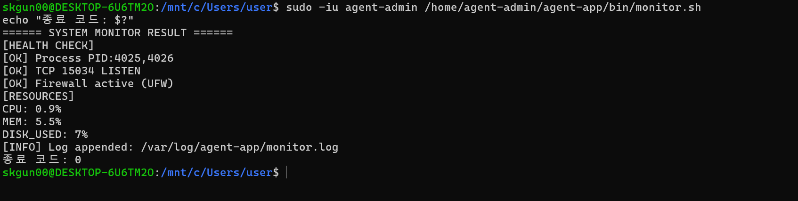

*캡처 6-1 — 모니터 정상 실행·로그 기록·종료 코드 0*

### 7.2 앱 중단 시 실패

앱을 Ctrl+C로 종료한 뒤 같은 모니터 실행 명령을 사용했다.

```text
[ERROR] App process is not running.
종료 코드: 1
```

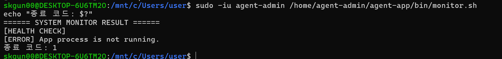

*캡처 6-2 — 실제 앱 중단 후 오류·종료 코드 1*

검증 후 공용 환경 설정을 읽고 앱을 절대 경로로 다시 실행했다. 포트만 사라지고 프로세스는 남는 상황의 별도 실행 시험은 하지 않았으며, 해당 실패 분기는 소스코드에서 확인했다.

### 7.3 자원 초과·방화벽 비활성 경고

실제 방화벽을 변경하거나 시스템 자원을 과도하게 사용하지 않고, 테스트 셸에서 경고 함수에 입력값을 전달하고 UFW 조회 함수를 재정의했다. 원본 스크립트와 실제 monitor.log에 테스트 수치를 기록하지 않았다.

```bash
sudo -iu agent-admin /bin/bash <<'BASH'
set -e
source /home/agent-admin/agent-app/bin/monitor.sh

warn_if_over CPU 21.0 20
warn_if_over MEM 11.0 10
warn_if_over DISK_USED 81 80

ufw_status() { printf 'Status: inactive\n'; }
check_firewall

echo "[TEST] 경고 후에도 계속 실행됨"
BASH
echo "테스트 종료 코드: $?"
```

결과: 자원 경고 3개, 방화벽 비활성 경고, 계속 실행 확인 문구가 출력됐으며 종료 코드는 0이었다. 이 캡처는 실제 자원 사용량이나 실제 UFW 비활성 상태를 측정한 증거가 아니라, 통제된 입력으로 경고 로직을 검증한 증거다.

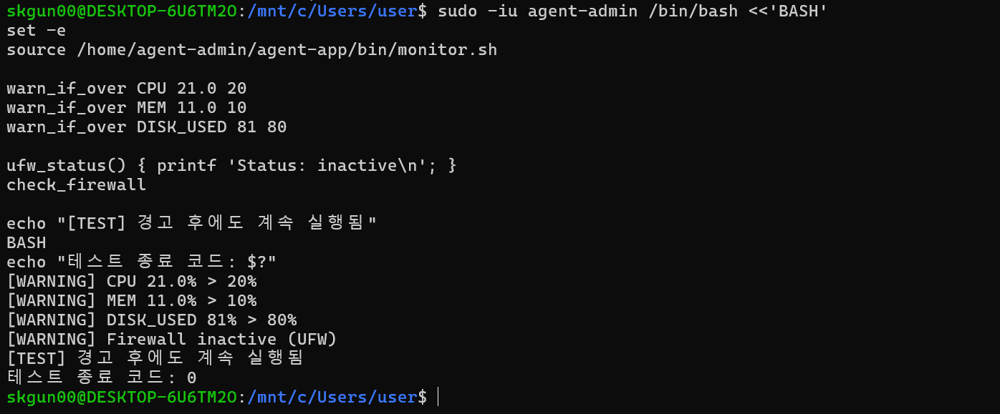

*캡처 6-3 — 통제된 입력의 경고 및 계속 실행·종료 코드 0*

### 7.4 방화벽 조회용 최소 sudo 권한

```bash
sudo -l -U agent-admin
```

확인된 허용 규칙:

```text
(root) NOPASSWD: /usr/sbin/ufw status
```

agent-admin에게 방화벽 상태 조회 명령만 비밀번호 없이 허용했다. `sudo -n`은 암호 입력을 요구하지 않으므로 cron에서 사용 가능하다. 이 규칙은 UFW 설정 변경이나 임의의 관리자 명령을 허용하지 않는다.

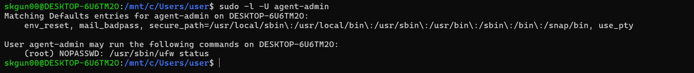

*캡처 6-4 — agent-admin의 UFW 상태 조회 전용 sudo 규칙*

### 7.5 로그 형식과 누적

```bash
sudo ls -l /home/agent-admin/agent-app/bin/monitor.sh
sudo -u agent-admin tail -n 5 /var/log/agent-app/monitor.log
```

공유 화면에는 이전 날짜의 기록과 다음과 같은 오늘 기록이 함께 있었다.

```text
[2026-10-08 22:29:03] PID:4025,4026 CPU:0.2% MEM:5.3% DISK_USED:7%
[2026-10-08 22:29:07] PID:4025,4026 CPU:0.9% MEM:5.5% DISK_USED:7%
[2026-10-08 22:30:02] PID:4025,4026 CPU:1.0% MEM:6.4% DISK_USED:7%
```

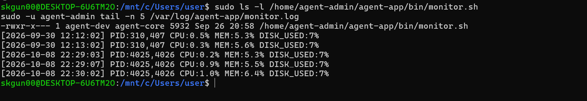

*캡처 7-1 — 운영 스크립트 소유자·그룹·권한 및 로그 누적*

## 8. cron 매분 자동 실행

```bash
sudo crontab -u agent-admin -l
```

확인된 등록 내용:

```cron
* * * * * /bin/bash /home/agent-admin/agent-app/bin/monitor.sh 2>&1 | /usr/bin/logger -t agent-monitor-study # agent-app-monitor-managed
```

다섯 필드는 분·시·일·월·요일이며, 모두 `*`이면 매분 실행한다. `2>&1`은 오류 출력을 일반 출력과 합치고, logger는 콘솔 출력을 시스템 로그로 전달한다. 지정된 monitor.log는 스크립트 내부에서 별도로 기록한다.

비교 시 다음 명령을 사용했다.

```bash
date '+%Y-%m-%d %H:%M:%S'
sudo -u agent-admin wc -l /var/log/agent-app/monitor.log
sudo -u agent-admin tail -n 3 /var/log/agent-app/monitor.log
```

| 구분 | 확인 시각 | 줄 수 | 마지막 로그 시각 |
| --- | --- | --- | --- |
| 기준 화면 | 2026-10-08 22:32:13 | 20 | 22:32:02 |
| 약 1분 후 | 2026-10-08 22:33:10 | 21 | 22:33:02 |

사용자가 수동 실행 없이 대기한 뒤 공유한 결과에서 새 기록과 줄 수 증가를 확인했다.

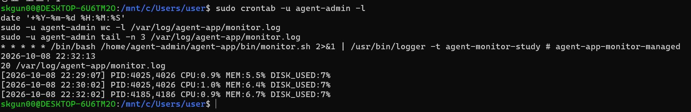

*캡처 8-1 — cron 매분 등록·로그 20줄·기준 시각*

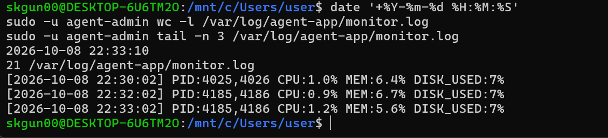

*캡처 8-2 — 다음 분에 로그 21줄로 자동 증가*

cron 파이프라인의 최종 상태는 logger의 종료 상태일 수 있으므로, 모니터 자체의 종료 코드 1은 앞의 직접 실행 시험으로 별도 검증했다.

## 9. 필수 로그 용량 관리

### 9.1 적용 정책

- 용량 기준: 10 × 1024 × 1024 = 10,485,760바이트(10MiB).
- 새 줄과 줄바꿈을 추가했을 때 기준을 초과하면 먼저 순환한다.
- 가장 오래된 `monitor.log.9`를 삭제한다.
- 기존 `.8`부터 `.1`까지 역순으로 한 번호씩 이동한다.
- 현재 로그를 `monitor.log.1`로 이동한다.
- 새로운 현재 파일에 `>>`로 기록한다.
- 현재 로그와 백업 9개, 총 10개를 유지한다.

현재 로그가 이미 기준 크기 이하이고 정상적으로 순환이 수행되는 운영 상태에서, 관리 대상 로그의 내용 크기는 최대 약 100MiB로 제한된다. 이 정책은 `monitor.log`와 해당 백업에 적용되며, 앱 자체 로그나 시스템 저널 전체의 용량 정책은 아니다.

### 9.2 임시 파일을 이용한 검증

실제 운영 로그를 크게 만들지 않고, 임시 폴더의 LOG_FILE을 대상으로 기존 write_log 함수를 호출했다.

```bash
sudo -iu agent-admin /bin/bash <<'BASH'
set -e
source /home/agent-admin/agent-app/bin/monitor.sh

rotation_dir=$(mktemp -d /tmp/agent-rotation-test.XXXXXX)
LOG_FILE="$rotation_dir/monitor.log"

for n in {1..9}; do
  printf 'backup-%s\n' "$n" > "$LOG_FILE.$n"
done

truncate -s $((10*1024*1024)) "$LOG_FILE"
write_log "rotation-test"

stat -c '%n : %s bytes' "$LOG_FILE" "$LOG_FILE".[1-9]

file_count=$(find "$rotation_dir" -type f -name 'monitor.log*' | wc -l)
echo "로그 파일 수: $file_count"
test "$file_count" -eq 10
test "$(cat "$LOG_FILE.9")" = "backup-8"

echo "새 현재 로그:"
cat "$LOG_FILE"
echo "[PASS] 용량 기준 순환과 최대 10개 유지 확인"
BASH
echo "테스트 종료 코드: $?"
```

| 확인 항목 | 결과 |
| --- | --- |
| 새 monitor.log | 14바이트, rotation-test 기록 |
| monitor.log.1 | 10,485,760바이트 |
| 파일 개수 | 10 |
| 가장 오래된 백업 처리 | 기존 backup-8이 .9로 이동한 검사 통과 |
| 계속 기록 가능 여부 | 새 현재 로그 생성·기록 성공 |
| 테스트 종료 코드 | 0 |

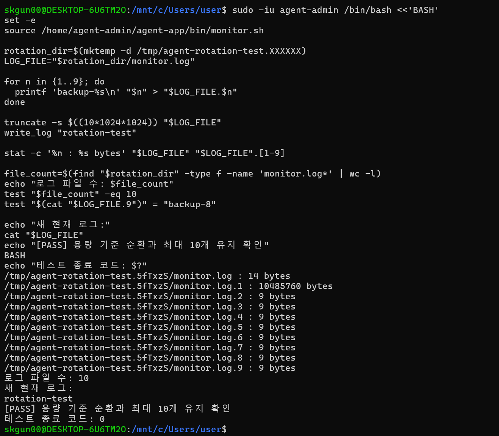

*캡처 9 — 임시 로그의 용량 기준 순환·총 10개 유지·종료 코드 0*

이 용량·개수 관리 기능은 필수 요구사항이다. 평균·최대·최소 통계, 7일 압축, 아카이브 이동, 30일 삭제는 구현하지 않았다.

## 10. 평가 요소별 설명 준비

### 10.1 항목 1: 설정과 실제 동작

SSH·방화벽, 계정·그룹·접근 권한, 앱 시작 검사, 프로세스·포트 점검, 로그 누적, cron 자동 실행, 용량 관리에 각각의 증거를 연결한다. 설정값 확인과 실제 동작 확인을 함께 제시한다.

Agent READY 문구가 포함된 최종 캡처는 추가 확인이 필요하다.

### 10.2 항목 2: 구현 방법

- 프로세스는 pgrep으로 식별하고 ss의 포트 소유 PID와 비교했다.
- CPU는 누적값 두 시점의 차이, 메모리는 MemAvailable 기준, 디스크는 df의 고정 형식으로 계산·추출했다.
- 로그의 시간·필드 이름·숫자 표현을 일정하게 해 후속 파싱이 가능하도록 했다.
- 스크립트 관리자는 agent-dev, 실행자와 cron 계정은 agent-admin으로 구분했다.
- 크기를 확인하고 파일 이름을 순환시키는 방식으로 현재 로그 포함 10개를 유지했다.

### 10.3 항목 3: 설계 이유

- SSH 포트 변경은 단순 자동 스캔을 줄이는 보조 조치다.
- Root 직접 접속을 제한하고 일반 계정에서 필요한 작업에만 sudo를 사용한다.
- 공용 업로드와 운영 키·로그의 권한을 나눠 최소 권한을 적용한다.
- 서비스가 없는 경우는 실패로 종료하고, 자원 초과 등은 경고 후 나머지 점검을 계속한다.
- `>>`로 이력을 누적해 이전 상태와 장애 전후를 비교할 수 있게 한다.

### 10.4 항목 4: 상황 변경과 장애 대응

#### A. 모니터링 대상이 Nginx로 바뀐다면

Nginx의 master/worker 프로세스 구조에 맞게 식별 방법을 바꾸고, 실제 서비스 포트·로그 경로·접근 권한을 확인한다. 서비스 환경에 맞게 임계값을 정한다. 현재의 명령행 전체 일치 조건을 파일명만 바꿔 그대로 적용하기보다, 해당 서비스의 기동 방식에 맞춰 수정해야 한다.

#### B. 프로세스는 있는데 포트가 열리지 않는다면

1. 프로세스 상태와 실제 실행 명령을 확인한다.
2. ss로 실제 LISTEN 주소·포트·소유 프로세스를 확인한다.
3. 앱 로그에서 초기화 실패·지연, 설정 오류, bind 실패 등을 확인한다.
4. 잘못된 포트, 다른 프로세스의 포트 점유, 환경 변수·권한 문제를 확인한다.
5. 로컬 LISTEN은 정상인데 외부 접속이 실패할 때 방화벽과 WSL 네트워크 경로를 확인한다.

방화벽의 연결 차단과 앱 자체가 LISTEN 소켓을 만들지 못한 상황을 구분한다.

#### C. 로그 급증으로 디스크가 찰 위험이 있다면

단기적으로 디스크 사용량과 급증하는 로그를 확인하고, 필요한 장애 증거를 보존하면서 오래된 로그를 정책에 따라 정리하거나 불필요한 출력을 줄인다.

중기적으로 순환 정책의 실제 동작과 모든 로그 발생 경로를 점검하고, 디스크 사용량 감시 및 적정 로그 수준을 운영에 반영한다. monitor.log의 용량 관리만으로 앱 로그나 시스템 로그 전체의 증가가 제한되는 것은 아니다.

위 세 항목은 평가 질문에 대한 설명이며, Nginx 전환 등 추가 구현을 수행한 것은 아니다.

## 11. 제출 전 체크리스트

- [x] SSH 20022 및 Root 원격 로그인 차단 확인
- [x] UFW 활성화와 지정 두 TCP 포트 허용 확인
- [x] 계정·그룹 구성 확인
- [x] 디렉토리·ACL 및 실제 접근 권한 확인
- [x] Boot 5단계 OK 화면 확인
- [ ] Agent READY가 보이는 캡처 추가
- [x] 앱의 0.0.0.0:15034 LISTEN 확인
- [x] 운영 원본 monitor.sh의 소유자·그룹·750 권한 확인
- [x] 정상 실행 종료 코드 0 확인
- [x] 앱 중단 시 종료 코드 1 확인
- [x] 통제된 테스트 입력에 따른 경고·계속 실행 확인
- [x] UFW 조회 전용 sudo 권한 확인
- [x] 지정 형식의 로그 누적 확인
- [x] agent-admin cron 매분 등록과 자동 로그 증가 확인
- [x] 임시 파일로 용량 기준 순환·총 10개 유지 검증
- [x] 사용자 실습 환경에서 제출용 monitor.sh 복사
- [x] 사용자가 보낸 실제 캡처를 해당 항목에 첨부
- [ ] 수행 내역서와 monitor.sh 두 제출물 최종 확인

## 12. 제출용 소스 복사 기록

사용자가 skgun00 계정에서 실행한 명령:

```bash
mkdir -p "$HOME/cody/submission"
sudo cat /home/agent-admin/agent-app/bin/monitor.sh > "$HOME/cody/submission/monitor.sh"
ls -l "$HOME/cody/submission/monitor.sh"
```

복사본 경로: `/home/skgun00/cody/submission/monitor.sh`

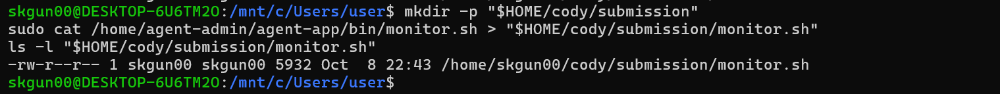

*제출용 소스 복사 — skgun00 소유의 5,932바이트 monitor.sh*

Windows 탐색기에서 해당 폴더를 여는 명령:

```bash
cd "$HOME/cody/submission"
explorer.exe .
```

## 부록. monitor.sh 전체 소스

아래 소스는 사용자가 공유한 기존 monitor.sh에서 추출했다. 별도 제출 파일 `monitor.sh`에도 동일한 내용이 들어 있다. 사용자 실습 환경에서 관찰한 5,932바이트와 추출 파일 크기가 일치한다. 원격 원본과의 해시 비교는 수행하지 않았다.

공용 `agent-env.sh`의 최종 설정은 5.1절에 기록했다. 모니터는 운영 경로의 해당 설정 파일을 읽는다. 별도 monitor.sh를 다른 디렉토리에서 실행하는 경우에도 기본값은 운영 경로를 기준으로 하므로, 제출 파일만 옮기는 것이 전체 실습 환경 배포를 의미하지는 않는다.

```bash
#!/usr/bin/env bash
# 필수 과제: 상태 확인 → 자원 수집 → 경고 → 로그 기록/회전.

error() { printf '[ERROR] %s\n' "$*" >&2; }

# 제공 바이너리는 run-app.sh가 절대 경로로 실행한다.
# -f: 명령행 전체, -x: 전체 일치. 검색 명령 자체를 앱으로 오인하지 않는다.
find_app_pids() { pgrep -f -x -- "$AGENT_APP_PATH"; }
list_app_port() { ss -H -ltnp "sport = :$AGENT_PORT"; }

health_check() {
    local pids listeners pid matched=0
    pids=$(find_app_pids) || { error 'App process is not running.'; return 1; }
    [[ -n $pids ]] || { error 'App process is not running.'; return 1; }
    listeners=$(list_app_port) || { error 'Cannot inspect TCP sockets.'; return 1; }
    [[ -n $listeners ]] || { error "TCP $AGENT_PORT is not LISTENING."; return 1; }
    # 다른 프로그램이 같은 포트를 차지한 경우도 성공으로 처리하지 않는다.
    for pid in $pids; do
        [[ $listeners != *"pid=$pid,"* ]] || matched=1
    done
    (( matched )) || { error "TCP $AGENT_PORT is not owned by the app (or its PID is unreadable)."; return 1; }
    APP_PIDS=${pids//$'\n'/,}
    printf '[OK] Process PID:%s\n[OK] TCP %s LISTEN\n' "$APP_PIDS" "$AGENT_PORT"
}

ufw_status() { sudo -n /usr/sbin/ufw status; }

check_firewall() {
    local status
    if ! status=$(ufw_status 2>&1); then
        printf '[WARNING] Cannot query UFW; check the read-only sudo rule.\n'
    elif [[ $status == *'Status: active'* ]]; then
        printf '[OK] Firewall active (UFW)\n'
    else
        printf '[WARNING] Firewall inactive (UFW)\n'
    fi
    # 방화벽 경고는 치명적 오류가 아니다.
    return 0
}

read_cpu_counters() {
    # user, nice, system, idle, iowait, irq, softirq, steal만 합산.
    # guest 항목은 user 등에 이미 들어 있어 중복 합산하지 않는다.
    awk '/^cpu / {for(i=2;i<=9;i++) total+=$i; printf "%.0f %.0f\n",total,$5+$6; exit}' /proc/stat
}

cpu_from_counters() {
    # 두 시점의 누적값 차이로 1초 구간의 사용률을 구한다.
    awk -v total="$(($3-$1))" -v idle="$(($4-$2))" 'BEGIN {
        if(total<=0 || idle<0 || idle>total) exit 1
        printf "%.1f\n",100*(total-idle)/total
    }'
}

cpu_usage() {
    local total1 idle1 total2 idle2
    read -r total1 idle1 < <(read_cpu_counters) || return 1
    sleep 1
    read -r total2 idle2 < <(read_cpu_counters) || return 1
    cpu_from_counters "$total1" "$idle1" "$total2" "$idle2"
}

memory_usage() {
    awk '/^MemTotal:/ {t=$2} /^MemAvailable:/ {a=$2; found=1}
        END {if(t<=0 || !found || a<0 || a>t) exit 1; printf "%.1f\n",100*(t-a)/t}' /proc/meminfo
}

disk_usage() { df -P / | awk 'NR==2 {gsub(/%/,"",$5); print $5}'; }

warn_if_over() {
    if awk -v value="$2" -v limit="$3" 'BEGIN {exit !(value>limit)}'; then
        printf '[WARNING] %s %s%% > %s%%\n' "$1" "$2" "$3"
    fi
    return 0
}

write_log() {
    local line=$1 size=0 i
    local max_bytes=$((10*1024*1024))
    [[ ! -L $LOG_FILE ]] || { error 'Log must not be a symbolic link.'; return 1; }
    if [[ -e $LOG_FILE ]]; then
        [[ -f $LOG_FILE ]] || return 1
        size=$(stat -c %s -- "$LOG_FILE") || return 1
    fi
    # 새 줄을 더했을 때 10MiB를 초과하면 먼저 회전한다.
    if (( size + ${#line} + 1 > max_bytes )); then
        rm -f -- "$LOG_FILE.9" || return 1
        for ((i=8;i>=1;i--)); do
            if [[ -e $LOG_FILE.$i ]]; then
                mv -- "$LOG_FILE.$i" "$LOG_FILE.$((i+1))" || return 1
            fi
        done
        mv -- "$LOG_FILE" "$LOG_FILE.1" || return 1
    fi
    # 현재 로그 + .1~.9 = 총 10개. .1이 가장 최근의 백업이다.
    printf '%s\n' "$line" >> "$LOG_FILE" || return 1
}

main() (
    set -euo pipefail
    export LC_ALL=C PATH=/usr/sbin:/usr/bin:/sbin:/bin
    umask 0007
    local script_dir config tool cpu mem disk value
    script_dir=$(cd -- "$(dirname -- "${BASH_SOURCE[0]}")" && pwd)
    config=$script_dir/../agent-env.sh
    [[ ! -r $script_dir/agent-env.sh ]] || config=$script_dir/agent-env.sh
    if [[ -r $config ]]; then source "$config"; fi
    AGENT_HOME=${AGENT_HOME:-/home/agent-admin/agent-app}
    AGENT_APP_PATH=${AGENT_APP_PATH:-$AGENT_HOME/agent-app-linux-x86}
    AGENT_PORT=${AGENT_PORT:-15034}
    AGENT_LOG_DIR=${AGENT_LOG_DIR:-/var/log/agent-app}
    LOG_FILE=$AGENT_LOG_DIR/monitor.log
    [[ $(uname -s) == Linux ]] || { error 'Linux is required.'; return 1; }
    for tool in pgrep ss awk df stat flock date; do
        command -v "$tool" >/dev/null || { error "Missing command: $tool"; return 1; }
    done
    [[ -d $AGENT_LOG_DIR && -w $AGENT_LOG_DIR ]] || { error 'Log directory is not writable.'; return 1; }
    [[ ! -L $AGENT_LOG_DIR/.monitor.lock ]] || return 1
    exec 9>> "$AGENT_LOG_DIR/.monitor.lock"
    if ! flock -n 9; then echo '[INFO] Another monitor is running; skipped.'; return 0; fi

    printf '====== SYSTEM MONITOR RESULT ======\n[HEALTH CHECK]\n'
    health_check || return 1
    check_firewall
    cpu=$(cpu_usage) || { error 'Cannot measure CPU.'; return 1; }
    mem=$(memory_usage) || { error 'Cannot measure memory.'; return 1; }
    disk=$(disk_usage) || { error 'Cannot measure root filesystem.'; return 1; }
    for value in "$cpu" "$mem" "$disk"; do
        [[ $value =~ ^[0-9]+([.][0-9]+)?$ ]] || { error 'Invalid measurement.'; return 1; }
    done
    printf '[RESOURCES]\nCPU: %s%%\nMEM: %s%%\nDISK_USED: %s%%\n' "$cpu" "$mem" "$disk"
    warn_if_over CPU "$cpu" 20
    warn_if_over MEM "$mem" 10
    warn_if_over DISK_USED "$disk" 80
    write_log "[$(date '+%Y-%m-%d %H:%M:%S')] PID:$APP_PIDS CPU:$cpu% MEM:$mem% DISK_USED:$disk%" || {
        error 'Cannot write or rotate monitor.log.'; return 1;
    }
    printf '[INFO] Log appended: %s\n' "$LOG_FILE"
)

# source로 읽을 때는 함수만 정의하고, 직접 실행할 때만 main을 호출한다.
if [[ ${BASH_SOURCE[0]} == "$0" ]]; then main "$@"; fi
```
