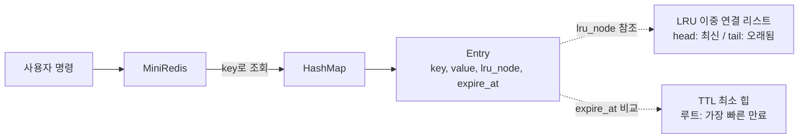
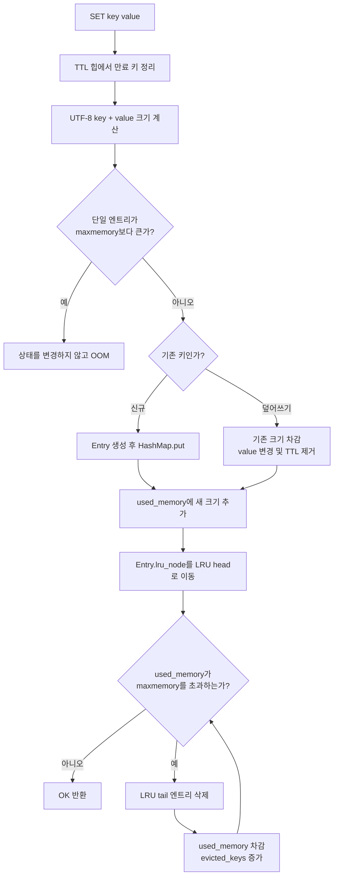
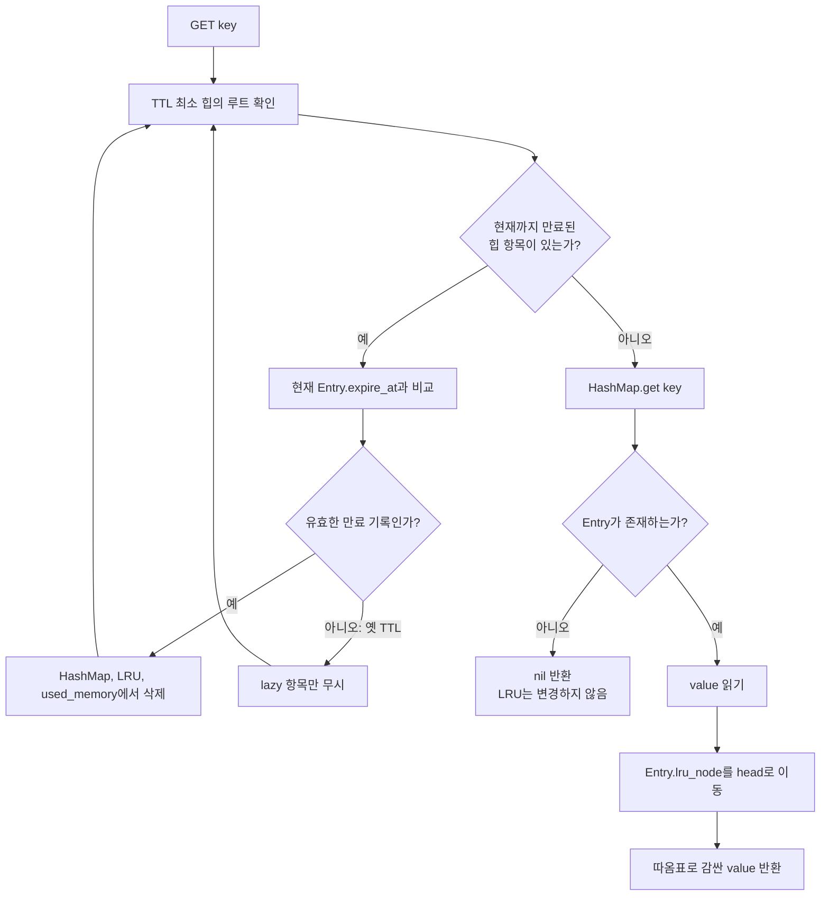
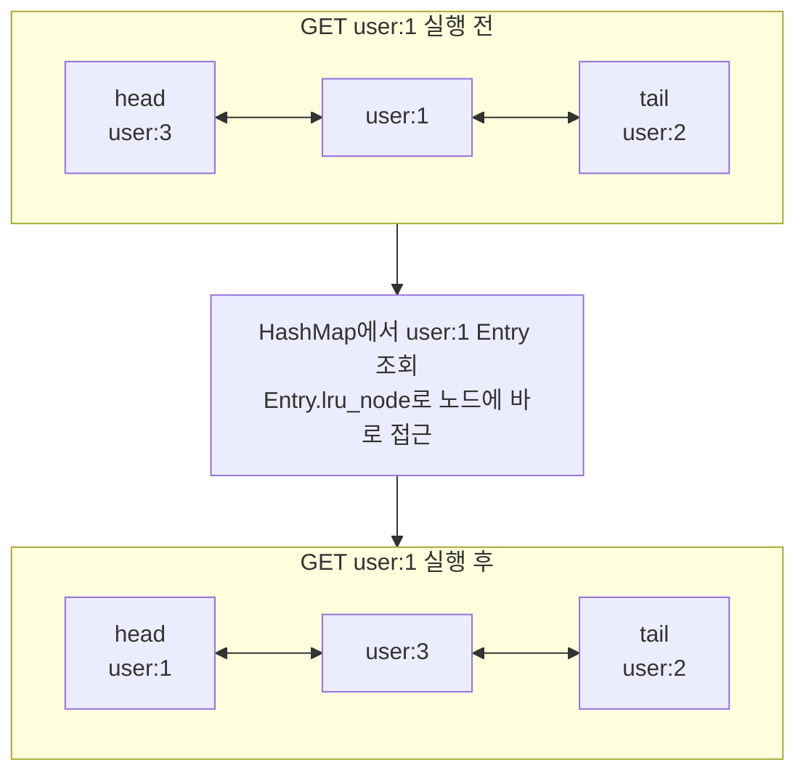
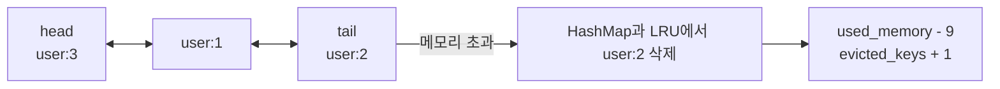
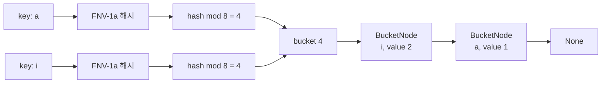
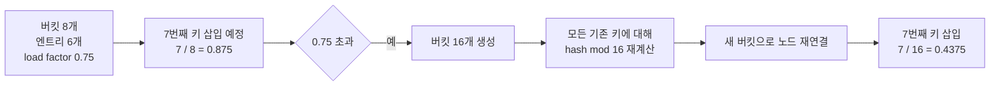
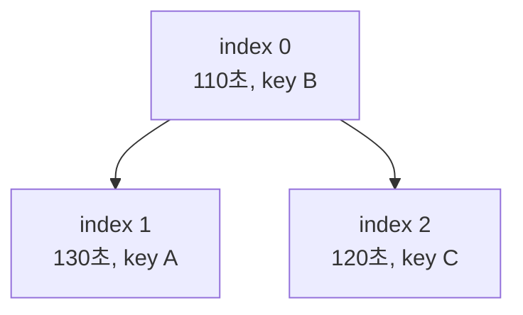
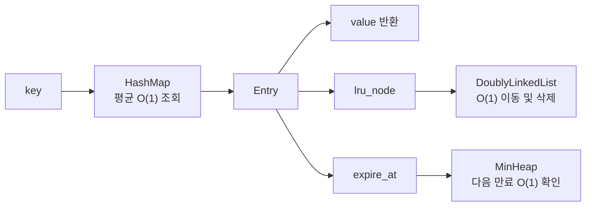

# Mini Redis

외부 Key-Value 컬렉션 없이 해시맵, 이중 연결 리스트, 최소 힙을 직접 구현한 Python 3.8+ CLI 저장소입니다. String 명령, LRU 메모리 제한, TTL, Redis 스타일 출력과 오류 처리를 지원합니다. 선택 과제인 동적 배열, 스택/큐/덱, 이진 트리, BST, Pub/Sub도 포함합니다.

평가 질문별 설명과 시연 순서는 [EVALUATION_GUIDE.md](EVALUATION_GUIDE.md)에 별도로 정리했습니다.

## 실행과 테스트

별도 패키지 설치가 필요하지 않습니다.

```bash
python main.py
```

종료할 때는 `exit` 또는 `quit`을 입력합니다. 전체 자동 테스트는 다음과 같이 실행합니다.

```bash
python -m unittest discover -v
```

## 명령어

| 명령 | 설명 | 정상 출력 |
|---|---|---|
| `SET key value` | 문자열 저장, 기존 키면 TTL 제거 및 LRU 갱신 | `OK` |
| `GET key` | 문자열 조회, 성공한 조회만 LRU 갱신 | `"value"` 또는 `(nil)` |
| `DEL key` | 데이터, TTL, LRU 정보를 함께 삭제 | `(integer) 0/1` |
| `EXISTS key` | 키 존재 여부 | `(integer) 0/1` |
| `DBSIZE` | 만료 정리 후 현재 키 개수 | `(integer) N` |
| `KEYS` | 현재 키 목록, 순서는 보장하지 않음 | 번호 목록 또는 `(empty array)` |
| `CONFIG SET maxmemory bytes` | 0 이상 바이트 제한 설정, 0은 무제한 | `OK` |
| `INFO memory` | 사용량, 제한, LRU 제거 누계 | 3개 필드 |
| `EXPIRE key seconds` | 초 단위 TTL 설정, 0 이하는 즉시 만료 | `(integer) 0/1` |
| `TTL key` | 남은 TTL, TTL 없음은 -1, 키 없음은 -2 | `(integer) N` |

값은 공백 없는 토큰 또는 따옴표 문자열로 입력할 수 있습니다.

```text
mini-redis> CONFIG SET maxmemory 30
OK
mini-redis> SET user:1 "Alice"
OK
mini-redis> SET user:2 "Bob"
OK
mini-redis> SET user:3 "Charlie"
OK
mini-redis> GET user:1
(nil)
mini-redis> INFO memory
used_memory:22
maxmemory:30
evicted_keys:1
```

## 프로젝트 구조

```text
.
|-- main.py                         # 실행 진입점
|-- cli.py                          # REPL
|-- mini_redis.py                   # 저장소, TTL/LRU, 명령 파서
|-- pubsub.py                       # 보너스 Pub/Sub
|-- structures/
|   |-- doubly_linked_list.py       # LRU와 큐/덱의 기반
|   |-- hash_map.py                 # FNV-1a + 체이닝 해시맵
|   |-- min_heap.py                 # TTL 최소 힙
|   |-- dynamic_array.py            # capacity 2배 동적 배열
|   |-- linear_collections.py       # 스택/큐/덱
|   |-- binary_tree.py              # 배열 기반 완전 이진 트리/순회
|   `-- binary_search_tree.py       # BST 삽입/탐색/삭제/중위 순회
|-- tests/                          # 18개 자동 테스트
`-- STACK_QUEUE_DEQUE.md            # 보너스 개념 문서
```

Python의 `dict`, `set`, `collections`는 저장소 구현에 사용하지 않았습니다. Python 리스트는 명세가 허용한 고정 길이 배열/인덱스 저장 공간으로만 사용하며, 확장 로직은 `DynamicArray`와 `HashMap`이 직접 수행합니다.

## 설계와 복잡도

한 키는 다음 세 구조에 연결됩니다.



| 연산 | 평균 시간 | 비고 |
|---|---:|---|
| 해시맵 `put/get/remove/contains` | O(1) | 리사이즈는 O(n), 삽입 기준 분할 상환 O(1) |
| LRU 삽입/삭제/이동 | O(1) | `Entry.lru_node`로 노드를 직접 참조 |
| TTL `push/pop` | O(log n) | 가장 빠른 만료 조회 `peek`는 O(1) |
| `SET`, `GET`, `DEL`, `EXISTS` | 평균 O(1) | 만료 정리 k건이 있으면 추가 O(k log n) |
| `DBSIZE` | 평상시 O(1) | 실행 시점 만료 정리 비용 제외 |
| `KEYS` | O(n) | 전체 버킷 순회 |

TTL 힙은 lazy deletion을 사용합니다. 같은 키의 TTL을 다시 설정하거나 `SET`으로 TTL을 없애도 옛 힙 레코드를 임의 위치에서 찾지 않습니다. 레코드가 힙 루트에 도달했을 때 현재 `Entry.expire_at`과 같을 때만 실제 키를 지웁니다.

## 자료구조 사용 과정 그림

아래 다이어그램은 GitHub README에서 그림으로 렌더링됩니다.

### 1. SET 명령 처리 과정

`SET`은 해시맵에 데이터를 저장하고 LRU를 갱신한 뒤, 메모리가 넘치면 오래된 키를 제거합니다.



### 2. GET 명령 처리 과정

`GET`은 LRU 리스트를 순회하지 않습니다. 해시맵에서 `Entry`를 찾고 `Entry.lru_node`로 해당 LRU 노드에 바로 접근합니다.



### 3. GET으로 LRU 순서가 바뀌는 과정

`user:1`을 조회하면 해당 노드를 리스트의 맨 앞으로 옮깁니다.



메모리가 초과되면 `tail`의 `user:2`가 제거됩니다.



### 4. 해시맵 조회와 체이닝

키를 FNV-1a 해시 함수에 넣고 버킷 개수로 나눈 나머지를 인덱스로 사용합니다. 서로 다른 키가 같은 인덱스를 얻으면 버킷 내부 연결 리스트에 이어 붙입니다.



체이닝은 해시 충돌을 해결하기 위한 단일 연결 리스트이고, LRU 이중 연결 리스트는 최근 사용 순서를 관리하는 별도의 구조입니다.

### 5. 로드 팩터 초과와 버킷 확장

초기 버킷이 8개일 때 7번째 키를 넣으려 하면 예정 로드 팩터가 0.875가 됩니다. 기준 0.75를 넘으므로 버킷을 16개로 확장하고 모든 키를 재해시합니다.



단순히 빈 버킷만 `append`하면 기존 키는 옛 위치에 남습니다. capacity가 바뀌면 `hash % capacity` 결과도 바뀌므로 기존 키를 반드시 새 인덱스로 옮겨야 합니다.

### 6. TTL 최소 힙 동작

최소 힙은 가장 빠른 만료 시각을 루트에 둡니다. 내부에서는 직접 구현한 `DynamicArray`에 완전 이진 트리를 1차원으로 저장합니다.



배열과 트리 인덱스의 관계는 다음과 같습니다.

```text
배열: [(110, B), (130, A), (120, C)]

부모       = (i - 1) // 2
왼쪽 자식  = 2 * i + 1
오른쪽 자식 = 2 * i + 2
```

현재 시각이 115초라면 루트의 B를 삭제하고 `_heapify_down`으로 다음 최솟값 C를 루트에 배치합니다.


### 7. 자료구조별 역할 요약



---

## 평가 항목 1 - 기능 동작

### String 기본 명령

- `SET`, `GET`, `DEL`, `EXISTS`, `DBSIZE`, `KEYS`를 `MiniRedis.execute`에서 인자 수까지 검사하여 처리합니다.
- `SET` 덮어쓰기는 기존 바이트를 먼저 빼고 새 바이트를 더하므로 `used_memory`가 중복 계산되지 않으며, 기존 TTL을 제거합니다.
- `DEL`은 해시맵 데이터, LRU 노드, TTL 상태를 한 번에 정리합니다.
- 키 기반 명령과 전체 조회 명령 모두 실행 전 최소 힙에서 도래한 만료를 정리합니다.

### LRU 자동 제거

- LRU 리스트의 `head`는 가장 최근 사용, `tail`은 가장 오래 사용하지 않은 항목입니다.
- 성공한 `SET`과 값이 존재하는 `GET`은 해당 노드를 `head`로 옮깁니다. 실패한 `GET`은 순서를 바꾸지 않습니다.
- `maxmemory > 0`이고 `SET` 후 사용량이 제한을 넘으면 `tail`부터 반복 삭제합니다.
- 삭제마다 `evicted_keys`가 1 증가합니다. 만료와 명시적 `DEL`은 LRU 정책에 의한 제거가 아니므로 증가시키지 않습니다.
- 단일 `key + value` 자체가 제한보다 크면 기존 데이터를 변경하지 않고 OOM을 반환합니다.

### 메모리 정보

명세의 공식만 사용합니다.

```text
used_memory = sum(len(key.encode("utf-8")) + len(value.encode("utf-8")))
```

`INFO memory`는 아래 세 줄을 출력합니다.

```text
used_memory:<number>
maxmemory:<number>
evicted_keys:<number>
```

### TTL

- `EXPIRE`는 `(expire_at, key)`를 최소 힙에 넣고 `Entry`에도 같은 시각을 기록합니다.
- `TTL`은 없는 키 -2, TTL 없는 키 -1, 그 외에는 남은 정수 초를 반환합니다.
- `seconds <= 0`은 존재하는 키를 즉시 삭제하고 1을 반환합니다.
- 만료된 키는 데이터/LRU에서 제거되며, 이후 `GET`은 `(nil)`, `TTL`은 -2입니다.

### 표준 오류

```text
(error) ERR unknown command '<CMD>'
(error) ERR wrong number of arguments for '<CMD>' command
(error) ERR value is not an integer or out of range
(error) OOM command not allowed when used_memory > 'maxmemory'
```

정수 파서는 부호가 있는 64비트 십진수만 허용하므로 소수점, 밑줄, 범위 초과 값도 같은 정수 오류로 처리합니다. 닫히지 않은 따옴표에는 `(error) ERR syntax error`를 반환합니다.

---

## 평가 항목 2 - 직접 구현 자료구조

### 이중 연결 리스트

`DoublyLinkedNode`는 `prev`, `next`, `data`를 가집니다. 리스트는 `head`, `tail`을 직접 보관하므로 다음 메서드가 모두 O(1)입니다.

- `insert_front`, `insert_back`: 양 끝에 노드 연결
- `remove_front`, `remove_back`: 양 끝 노드 분리
- `remove_node`: 전달받은 노드의 양옆을 직접 연결
- `move_to_front`: 기존 위치에서 분리한 뒤 `head`에 재연결

### 해시 함수와 인덱스

해시맵은 실행마다 값이 달라지는 내장 문자열 해시 대신 64비트 FNV-1a를 직접 구현합니다.

1. `hash = 14695981039346656037`로 시작합니다.
2. 키를 UTF-8 바이트열로 바꿉니다.
3. 바이트마다 `hash = (hash XOR byte) * 1099511628211`을 계산합니다.
4. 결과를 64비트로 마스킹합니다.
5. `index = hash % bucket_capacity`로 버킷 인덱스를 정합니다.

따라서 한글 키도 UTF-8 바이트 기준으로 일관되게 처리됩니다.

### 체이닝 충돌 해결

각 버킷은 `BucketNode(key, value, next)`로 이루어진 단일 연결 체인의 머리를 보관합니다. 같은 인덱스의 키는 체인 앞에 삽입합니다. 조회/수정/삭제는 해당 체인만 순회하며, 삭제 시 이전 노드의 `next`를 다음 노드에 연결합니다.

### 로드 팩터 0.75와 확장

새 키를 넣기 전 `(size + 1) / capacity > 0.75`인지 검사합니다. 초과하면 다음 절차를 수행합니다.

1. 기존의 두 배 크기 버킷 배열을 만듭니다.
2. 모든 기존 체인 노드를 순회합니다.
3. 새 capacity로 `hash % capacity`를 다시 계산합니다.
4. 각 노드를 새 버킷 체인에 연결합니다.
5. 그 후 새 키를 삽입합니다.

capacity가 바뀌면 인덱스도 바뀌므로 기존 버킷 배열을 단순 복사하지 않고 반드시 재배치합니다.

---

## 평가 항목 3 - LRU, TTL, 명령 흐름

### LRU에 해시맵과 이중 연결 리스트가 모두 필요한 이유

- 해시맵은 키로 `Entry`를 평균 O(1)에 찾습니다.
- 이중 연결 리스트는 최근 사용 순서를 유지하고 임의 노드를 O(1)에 이동/삭제합니다.
- 리스트만 쓰면 키를 찾는 데 O(n), 해시맵만 쓰면 가장 오래된 키를 찾는 데 O(n)이 필요합니다.
- `Entry.lru_node`가 두 구조를 연결하므로 `조회(해시) + 갱신(리스트 이동)`이 평균 O(1)입니다.

### TTL에 최소 힙을 쓰는 이유

최소 힙은 가장 작은 `expire_at`, 즉 다음으로 만료될 항목을 루트에 둡니다. 전체 키를 매번 순회하는 O(n) 방식과 달리 다음 만료 확인은 O(1), 새 TTL 추가와 만료 제거는 O(log n)입니다. 키가 많아져도 도래하지 않은 만료를 검사하지 않아도 됩니다.

### 메모리 초과 eviction 흐름

1. `SET` 시작 전에 도래한 TTL을 제거합니다.
2. 새 엔트리의 UTF-8 `key + value` 크기를 구합니다.
3. 단일 엔트리가 제한보다 크면 상태를 바꾸지 않고 OOM을 반환합니다.
4. 신규 키면 크기를 더하고, 덮어쓰기면 `기존 크기 빼기 -> 새 크기 더하기`로 갱신합니다.
5. 성공한 SET의 LRU 노드를 맨 앞으로 옮깁니다.
6. `used_memory > maxmemory` 동안 LRU `tail`을 데이터와 LRU에서 제거합니다.
7. 제거한 크기를 `used_memory`에서 빼고 `evicted_keys`를 증가시킵니다.

### GET 전체 흐름

1. 최소 힙 루트부터 현재 시각까지 만료된 레코드를 정리합니다.
2. 대상 키가 만료되어 삭제됐거나 원래 없으면 `(nil)`을 반환합니다.
3. 존재하면 값을 가져옵니다.
4. 값 반환에 성공한 경우에만 LRU 노드를 맨 앞으로 이동합니다.
5. 문자열을 Redis 스타일 큰따옴표 형식으로 반환합니다.

따라서 만료된 키를 조회해도 LRU가 갱신되지 않습니다.

---

## 평가 항목 4 - 확장 질문

### LRU 대신 LFU를 구현한다면

단일 최근 사용 리스트를 빈도별 리스트 구조로 바꿔야 합니다.

- `Entry`에 `frequency`와 빈도 리스트의 노드 참조를 추가합니다.
- `frequency -> 이중 연결 리스트`를 찾는 별도 직접 구현 해시맵과 현재 최소 빈도 `min_frequency`를 둡니다.
- GET/SET 성공 시 기존 빈도 리스트에서 O(1)로 빼고 `frequency + 1` 리스트로 옮깁니다.
- 제거할 때 `min_frequency` 리스트의 꼬리를 선택합니다. 같은 빈도에서는 LRU 순서로 동률을 해소합니다.
- 기존의 key 해시맵, TTL 힙, 메모리 계산은 그대로 재사용할 수 있습니다.

이 구조는 평균 O(1) LFU가 가능하지만 빈도 버킷과 포인터가 추가되어 메모리 사용과 구현 복잡도가 커집니다. 오래된 고빈도 키가 영구히 남는 문제에는 주기적 빈도 감쇠도 고려해야 합니다.

### 데이터가 10만 건으로 늘 때 병목과 개선

- **해시맵 리사이즈 지연**: 한 번에 모든 노드를 재배치하면 특정 SET이 O(n) 동안 멈춥니다. 두 버킷 배열을 잠시 함께 두고 명령마다 일부 버킷만 옮기는 incremental rehash로 지연을 분산할 수 있습니다.
- **충돌 체인**: 입력 분포가 좋지 않거나 의도적 충돌이 많으면 한 버킷이 O(n)이 됩니다. 더 강한 시드 기반 해시, 적절한 로드 팩터, 충돌 길이 관측으로 개선할 수 있습니다.
- **TTL lazy 레코드 증가**: 같은 키의 EXPIRE 반복은 오래된 힙 항목을 남깁니다. `heap_size`가 실제 TTL 키 수의 일정 배수를 넘을 때 활성 TTL만으로 힙을 재구축할 수 있습니다. 만료가 매우 많다면 시간 휠도 대안입니다.
- **KEYS 전체 순회**: O(n) 결과와 메모리를 한 번에 만듭니다. 커서 기반 `SCAN`으로 작은 묶음씩 반환하면 긴 정지와 대형 출력 버퍼를 피할 수 있습니다.
- **객체/포인터 오버헤드**: Entry, LRU 노드, 버킷 노드가 키마다 생깁니다. 슬롯 기반 노드, 인덱스 기반 연속 배열, 객체 풀을 적용하면 메모리 지역성과 사용량을 개선할 수 있습니다.
- **LRU 제거 폭주**: 큰 SET 한 번이 많은 키를 연속 제거할 수 있습니다. 운영 환경이라면 제거 개수 상한, 백그라운드 정리, 근사 LRU 샘플링을 검토합니다.

### 자료구조 오버헤드를 used_memory에 포함한다면

현재 공식은 과제의 공정한 채점 기준인 UTF-8 payload만 계산합니다. 실제 메모리를 포함하면 다음도 더해야 합니다.

- `Entry`, `BucketNode`, `DoublyLinkedNode`, `HeapItem` 객체 헤더와 필드
- 해시 버킷 배열과 동적 배열의 예약됐지만 비어 있는 슬롯
- 키/값 문자열 객체, UTF-8 표현, 포인터 정렬 및 메모리 할당자 단위
- TTL 재설정으로 남은 lazy heap 레코드

공식이 바뀌면 같은 `maxmemory`에서도 더 적은 키만 저장되고, 리사이즈 순간이나 TTL 재설정 횟수에 따라 사용량이 달라져 eviction/OOM 시점이 앞당겨집니다.

공정한 비교를 위해서는 Python 버전, 32/64비트, 메모리 할당자와 측정 시점을 고정해야 합니다. `sys.getsizeof`를 객체 그래프에 대해 중복 참조 없이 재귀 합산하거나 프로세스 RSS를 같은 워크로드 전후로 측정하고, 빈 저장소 기준값을 뺍니다. 구현 간 비교에는 동일한 키/값/TTL/LRU 명령 시퀀스와 동일한 측정 도구를 사용해야 합니다. payload 기준과 실제 RSS 기준은 의미가 다르므로 결과를 별도 지표로 표시하는 것이 안전합니다.

---

## 보너스 과제

1. `DynamicArray`: `append/get/set/remove/pop`, capacity 2배 확장을 직접 구현했습니다.
2. `Stack`, `Queue`, `Deque`: 동적 배열과 이중 연결 리스트를 재사용했습니다. 개념과 복잡도는 [STACK_QUEUE_DEQUE.md](STACK_QUEUE_DEQUE.md)에 정리했습니다.
3. `BinaryTree`: 완전 이진 트리를 배열로 표현하고 전위/중위/후위/레벨 순회를 제공합니다.
4. `BinarySearchTree`: 삽입, 탐색, 0/1/2자식 삭제, 중위 정렬 결과를 제공합니다.
5. `PubSubBroker`: 채널별 연결 리스트와 구독자별 큐를 사용합니다.

Pub/Sub CLI 예시는 다음과 같습니다. 구독자 이름을 생략하면 `cli`를 사용합니다.

```text
mini-redis> SUBSCRIBE news alice
(integer) 1
mini-redis> PUBLISH news "hello"
(integer) 1
mini-redis> POLL news alice
"hello"
```

## 테스트 범위

`tests/`는 다음을 검증합니다.

- 모든 필수 명령과 Redis 스타일 출력
- 충돌 체이닝, 수정/삭제, 0.75 초과 리사이즈
- 이중 연결 리스트의 양 끝 연산과 `move_to_front`
- 최소 힙 순서
- GET 기반 LRU 순서 갱신과 자동 제거
- OOM 시 기존 상태 보존
- 한글 UTF-8 메모리 계산
- TTL 만료, 재설정 lazy deletion, SET의 TTL 초기화, 즉시 만료
- 잘못된 명령/인자/정수/따옴표 오류
- 동적 배열, 스택/큐/덱, 이진 트리, BST, Pub/Sub

현재 테스트 개수는 18개이며 표준 라이브러리 `unittest`만 사용합니다.
