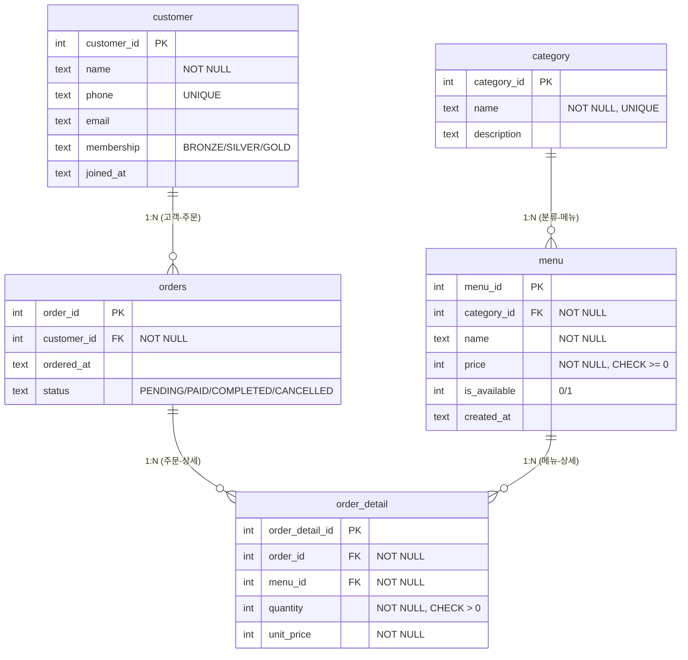

# ERD - 카페 주문 데이터베이스

## Mermaid ER 다이어그램
> GitHub, VS Code(Markdown Preview Mermaid), https://mermaid.live 에서 렌더링됩니다.



## 관계 요약 (1:N 4개)
| 부모(1) | 자식(N) | FK | 의미 |
|---------|---------|-----|------|
| category | menu | menu.category_id → category.category_id | 한 분류에 여러 메뉴 |
| customer | orders | orders.customer_id → customer.customer_id | 한 고객이 여러 번 주문 |
| orders | order_detail | order_detail.order_id → orders.order_id | 한 주문에 여러 품목 |
| menu | order_detail | order_detail.menu_id → menu.menu_id | 한 메뉴가 여러 주문에 담김 |

> `orders` ↔ `menu` 의 N:M 관계를 `order_detail` 교차 테이블로 분해해 1:N 두 개로 표현했다.

---

### dbdiagram.io DSL (선택, https://dbdiagram.io 에 붙여넣기)
```dbml
Table category {
  category_id integer [pk, increment]
  name text [not null, unique]
  description text
}
Table menu {
  menu_id integer [pk, increment]
  category_id integer [not null, ref: > category.category_id]
  name text [not null]
  price integer [not null]
  is_available integer
  created_at text
}
Table customer {
  customer_id integer [pk, increment]
  name text [not null]
  phone text [unique]
  email text
  membership text
  joined_at text
}
Table orders {
  order_id integer [pk, increment]
  customer_id integer [not null, ref: > customer.customer_id]
  ordered_at text
  status text
}
Table order_detail {
  order_detail_id integer [pk, increment]
  order_id integer [not null, ref: > orders.order_id]
  menu_id integer [not null, ref: > menu.menu_id]
  quantity integer [not null]
  unit_price integer [not null]
}
```
