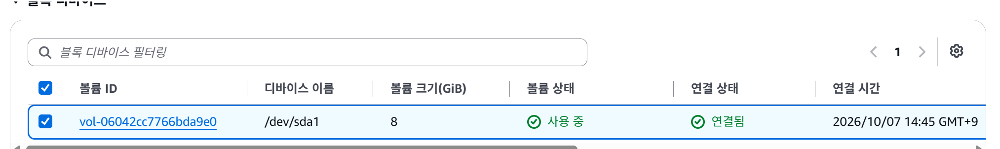
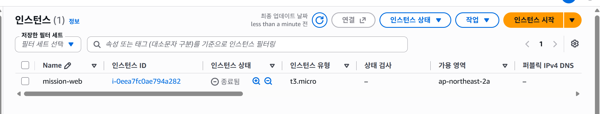
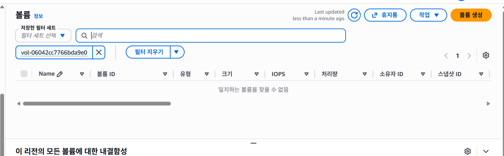
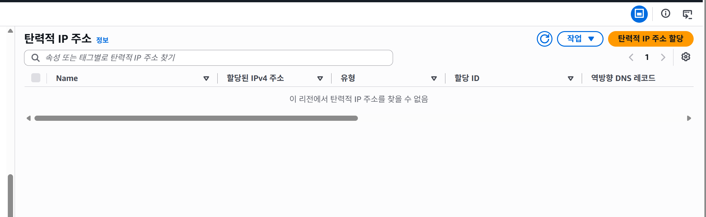
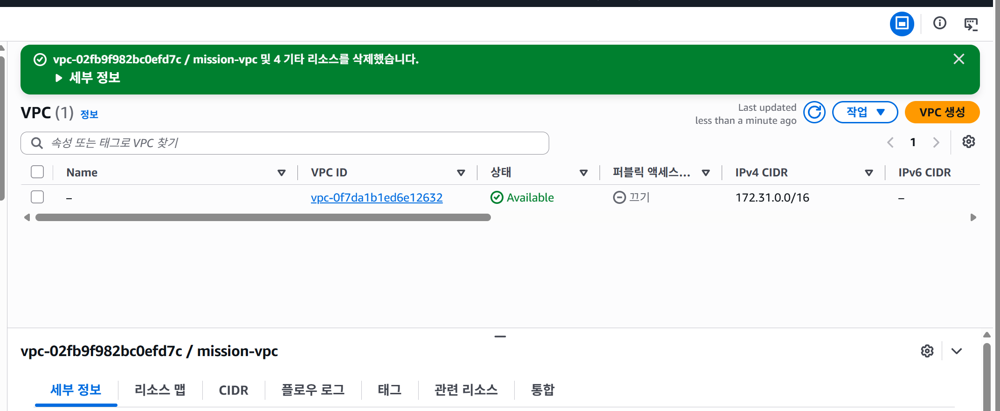
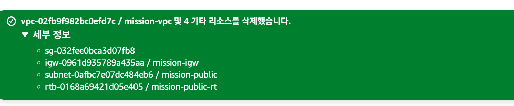
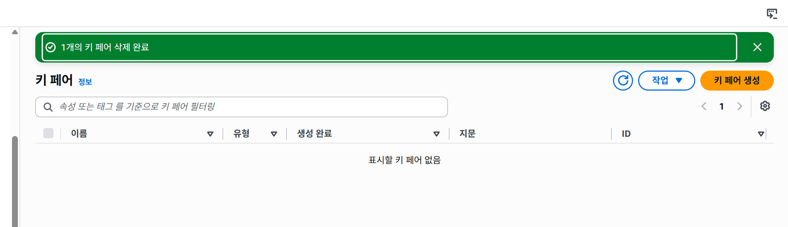
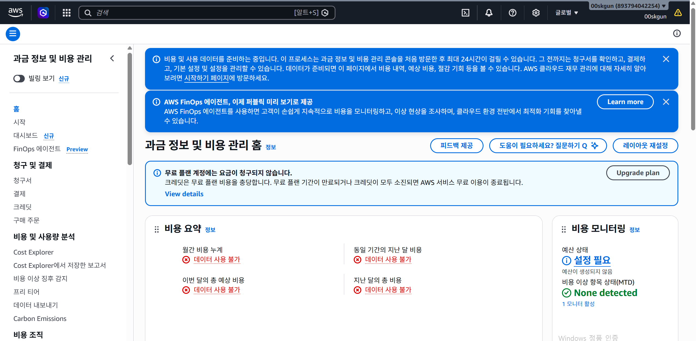
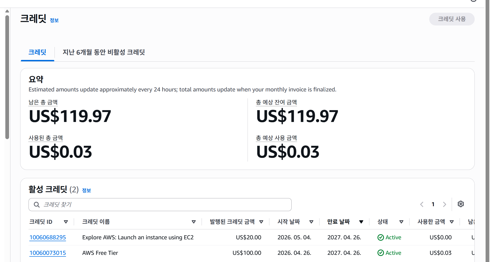

# AWS 실습 리소스 정리 체크리스트

현재 상태: **실습 리소스 정리 및 증빙 문서 작성 완료**. Billing과 크레딧 화면 확인 완료. 서울 리전의 NAT Gateway·로드 밸런서·RDS 데이터베이스 목록이 비어 있음을 사용자가 확인했다. 월별 비용 금액은 데이터 준비 후 재확인할 항목으로 남겼다. 리전은 서울 `ap-northeast-2`이며, 정리 대상은 이번 실습에서 만든 리소스다.

## 삭제 전 증빙 보관

- [x] `docs/external-access.png`: 브라우저 주소창과 Nginx 페이지 저장 및 README 본문 첨부.
- [x] `docs/server-validation.png`: Nginx active와 두 HTTP 200 응답 저장 및 문서 본문 첨부.
- [x] `docs/architecture.png`, README, 트러블슈팅 보고서 확인. 오류 당시 원본 캡처도 보관.
- [x] EC2의 스토리지 탭에서 연결된 실습 EBS 볼륨 ID 기록: `vol-06042cc7766bda9e0`, `/dev/sda1`, 8GiB. 캡처에서 사용 중·연결됨 확인.

| 항목 | 식별 정보 | 완료 근거 |
|---|---|---|
| EC2 | `mission-web`, `i-0eea7fc0ae794a282` | 2026-10-07 16:07 KST 캡처에서 종료됨 확인 |
| EBS | `vol-06042cc7766bda9e0`, `/dev/sda1`, 8GiB | 2026-10-07 16:12 KST 캡처에서 ID 검색 결과 없음 확인 |
| Elastic IP | 이번 구성은 자동 할당 퍼블릭 IP 사용 | 2026-10-07 16:14 KST 캡처에서 해당 리전의 탄력적 IP 목록 없음 확인 |
| Subnet | `mission-public`, `subnet-0afbc7e07dc484eb6` | 16:20 KST 캡처의 삭제 성공 세부 목록에서 확인 |
| Route Table | `mission-public-rt`, `rtb-0168a69421d05e405` | 16:20 KST 캡처의 삭제 성공 세부 목록에서 확인 |
| Security Group | `mission-web-sg`, `sg-032fee0bca3d07fb8` | 16:20 KST 캡처의 삭제 성공 세부 목록에서 확인 |
| Internet Gateway | `mission-igw`, `igw-0961d935789a435aa` | VPC 일괄 삭제 성공 세부 목록에서 삭제 확인. 별도 분리 화면은 없음 |
| VPC | `mission-vpc`, `vpc-02fb9f982bc0efd7c` | 2026-10-07 16:15 KST 캡처에서 삭제 성공 및 목록에 대상 없음 확인 |
| 키페어 | `mission-key` | 2026-10-07 16:23 KST 캡처에서 1개 삭제 성공 및 필터 없는 목록에 키페어 없음 확인 |

## 정리 증거

### 종료 전 EBS 볼륨 확인

2026-10-07 16:05에 저장한 원본 캡처. 볼륨 `vol-06042cc7766bda9e0`이 `/dev/sda1`로 연결되어 있으며 크기는 8GiB다. 이 화면은 종료 전 상태다.

### EC2 종료 확인

2026-10-07 16:07:19 KST에 저장한 원본 캡처. `mission-web` / `i-0eea7fc0ae794a282`의 상태가 **종료됨**으로 표시된다. 기록 시각은 캡처 저장 시각이며 정확한 종료 이벤트 시각은 별도로 확인하지 않았다.

### EBS 잔여 없음 확인

2026-10-07 16:12에 저장한 원본 캡처. 종료 전에 기록한 `vol-06042cc7766bda9e0`으로 검색한 결과 **일치하는 볼륨을 찾을 수 없음**이 표시된다. EC2 종료 후 해당 실습 볼륨이 남아 있지 않음을 확인했다.

### 탄력적 IP 잔여 없음 확인

2026-10-07 16:14:06 KST에 저장한 원본 캡처. 필터 없는 탄력적 IP 목록에 **이 리전에서 탄력적 IP 주소를 찾을 수 없음**이 표시된다. 별도로 릴리스할 탄력적 IP가 없음을 확인했다.

### VPC 삭제 확인

2026-10-07 16:15:32 KST에 저장한 원본 캡처. **vpc-02fb9f982bc0efd7c / mission-vpc 및 4 기타 리소스를 삭제했습니다**라는 성공 메시지가 표시되고, 목록에 실습 VPC는 없다.

2026-10-07 16:20:00 KST에 저장한 원본 캡처에서 성공 알림의 세부 정보를 펼쳤다. 실습 보안 그룹, 인터넷 게이트웨이, 서브넷, 라우팅 테이블의 ID가 모두 삭제 목록에 표시된다.

### 키페어 삭제 확인

2026-10-07 16:23에 저장한 원본 캡처. **1개의 키 페어 삭제 완료**라는 성공 메시지와 **표시할 키 페어 없음**이라는 필터 없는 목록을 확인했다. 실습 키페어 `mission-key`가 남아 있지 않다. AWS 키페어 삭제는 로컬 PC의 PEM 파일 삭제와 별개이며, PEM 파일은 제출 대상에서 제외했다.

### Billing 확인: 비용 데이터 준비 중

2026-10-07 16:34:30 KST에 저장한 원본 캡처. 루트 계정으로 청구 및 비용 관리 홈에 접속했다. 무료 플랜 계정에는 요금이 청구되지 않는다는 안내가 표시되지만 월간 비용 누계와 예상 비용은 **데이터 사용 불가**로 나타난다. 상단에는 첫 방문 후 데이터 준비에 최대 24시간이 걸릴 수 있다는 안내가 있다. 따라서 실습 비용 금액을 0원으로 확정하지 않았으며 데이터 준비 후 재확인한다. 크레딧 잔액은 이 화면에 표시되지 않는다.

### 크레딧 잔액 확인

2026-10-07 16:36:37 KST에 저장한 원본 캡처. 남은 총 금액과 총 예상 잔여 금액은 각각 **US$119.97**, 사용된 총 금액과 총 예상 사용 금액은 각각 **US$0.03**이다. 이는 계정 전체 크레딧 요약으로, 이번 실습에만 발생한 비용으로 단정하지 않는다. 화면에는 예상 금액은 약 24시간마다 갱신되고 총 금액은 월별 청구서 확정 시 갱신된다는 안내가 있다.

### 추가 리소스 잔여 없음 확인

2026-10-07, 서울 리전에서 VPC의 NAT 게이트웨이, EC2의 로드 밸런서, RDS의 데이터베이스 목록을 확인하도록 안내했다. 사용자가 세 목록 모두 비어 있다고 답했다. 이 항목의 근거는 사용자 확인이며, 별도 스크린샷은 제공되지 않았다.

## 정리 순서

1. EC2 → 인스턴스에서 `mission-web`을 선택해 **인스턴스 상태 → 인스턴스 종료(삭제)**. `Terminated`가 될 때까지 확인한다.
2. EC2 → 볼륨에서 기록한 실습 EBS 볼륨이 남았는지 확인한다. 자동 삭제되지 않고 `Available`로 남았다면 해당 실습 볼륨을 삭제한다.
3. EC2 → 탄력적 IP에서 이번 실습에 별도로 할당한 주소가 있는지 확인한다. 할당했다면 연결 해제 후 주소를 릴리스한다.
4. VPC 콘솔에서 `mission-vpc`를 선택해 **작업 → VPC 삭제**로 일괄 삭제했다. 성공 알림의 세부 목록에서 `mission-public`, `mission-public-rt`, `mission-web-sg`, `mission-igw` 삭제를 확인했다.
5. EC2 → 키페어에서 `mission-key` 삭제.
6. Billing에서 사용량과 크레딧 확인. 비용 데이터는 반영에 시간이 걸릴 수 있으므로 리소스 삭제 상태와 함께 기록한다.

## 완료 확인

- [x] 실습 EC2 상태가 `Terminated`. `cleanup-ec2-terminated.png`에서 확인.
- [x] 실습 EBS 볼륨이 남지 않음. `cleanup-ebs-absent.png`에서 기록한 ID 검색 결과 없음 확인.
- [x] 실습 Elastic IP 잔여 없음. `cleanup-eip-absent.png`에서 해당 리전의 목록 없음 확인.
- [x] `mission-public` 삭제. 삭제 성공 세부 목록에서 ID 확인.
- [x] `mission-public-rt` 삭제. 삭제 성공 세부 목록에서 ID 확인.
- [x] `mission-web-sg` 삭제. 삭제 성공 세부 목록에서 ID 확인.
- [x] `mission-igw` 삭제. VPC 일괄 삭제 성공 세부 목록에서 ID 확인.
- [x] `mission-vpc` 삭제. `cleanup-vpc-deleted.png`의 성공 메시지와 목록에서 확인.
- [x] `mission-key` 삭제. `cleanup-keypair-deleted.png`에서 삭제 성공과 목록 없음 확인.
- [x] Billing 홈 접속 및 현재 데이터 상태 기록. `cleanup-billing-pending.png` 참조.
- [ ] 비용 데이터 준비 후 이번 달 비용 금액 확인.
- [x] 정리 후 크레딧 잔액 확인. `cleanup-credits.png`에서 US$119.97 확인.
- [x] 서울 리전의 NAT Gateway·로드 밸런서·RDS 데이터베이스 목록이 비어 있음을 사용자 확인. 별도 캡처 없음.
- [x] 기록한 실습 리소스의 정리 확인 시각과 화면 근거 기록.
- [x] README의 현재 상태와 제출 전 체크박스 갱신. 미확인 사항은 구분하여 기록.

기록한 실습 리소스 정리 확인 시각(KST): 2026-10-07 16:23, 마지막 키페어 삭제 캡처 기준. 실제 각 삭제 이벤트 시각은 별도로 조회하지 않았다.

확인한 화면 또는 파일: 위 증거 섹션의 `cleanup-ec2-terminated.png`, `cleanup-ebs-absent.png`, `cleanup-eip-absent.png`, `cleanup-vpc-deleted.png`, `cleanup-network-deleted.png`, `cleanup-keypair-deleted.png`.

Billing 확인 내용과 시각: 2026-10-07 16:34 KST, 무료 플랜 안내 확인. 월간 비용 데이터는 준비 중으로 금액 확인 불가. 16:36 KST 크레딧 화면에서 잔여 US$119.97 및 계정 누적 사용 US$0.03 확인.

## 참고

- [AWS EC2 종료](https://docs.aws.amazon.com/AWSEC2/latest/UserGuide/terminating-instances.html)
- [EBS 종료 시 삭제 설정](https://docs.aws.amazon.com/AWSEC2/latest/UserGuide/preserving-volumes-on-termination.html)
- [AWS VPC 삭제](https://docs.aws.amazon.com/vpc/latest/userguide/delete-vpc.html)
