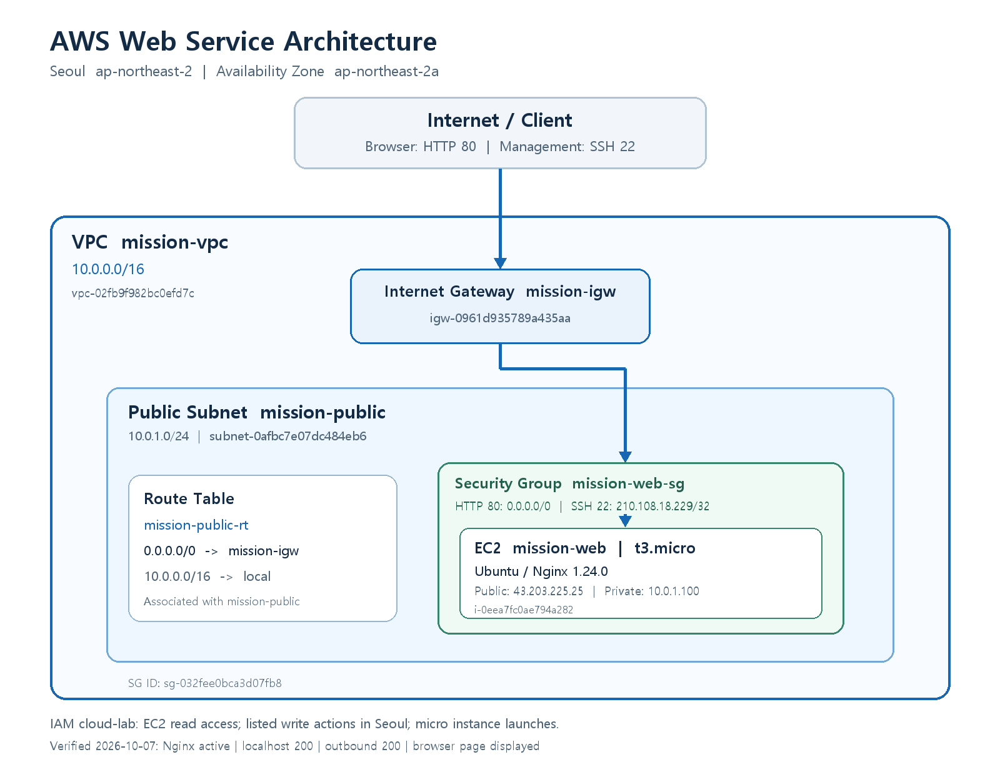
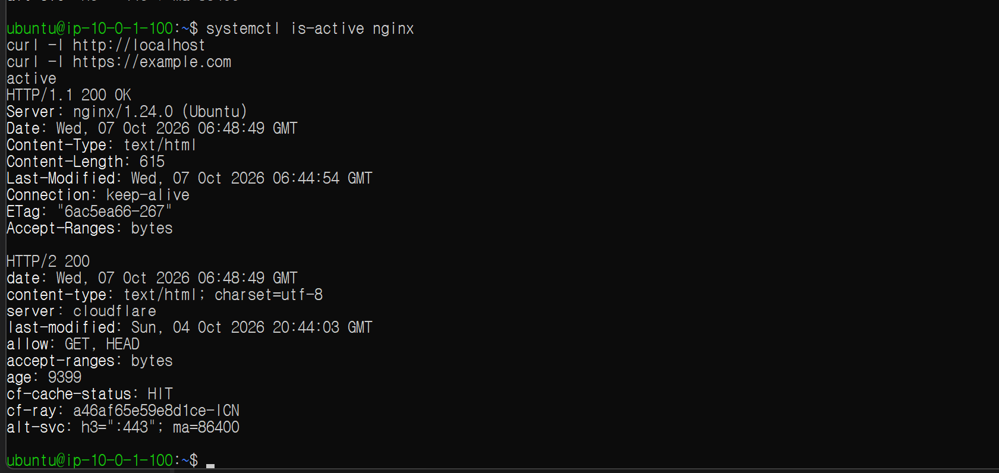
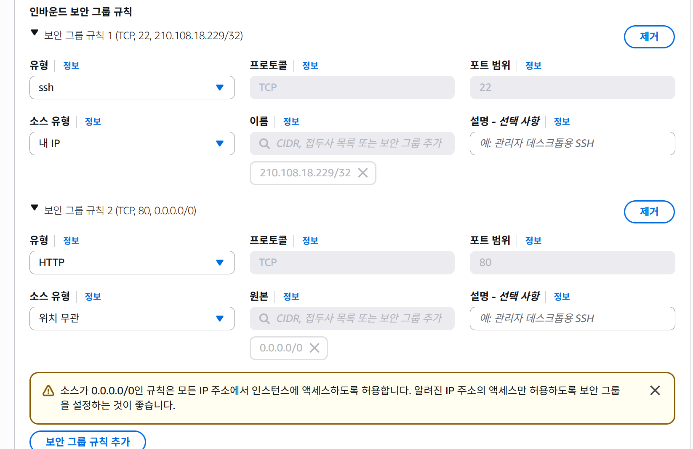
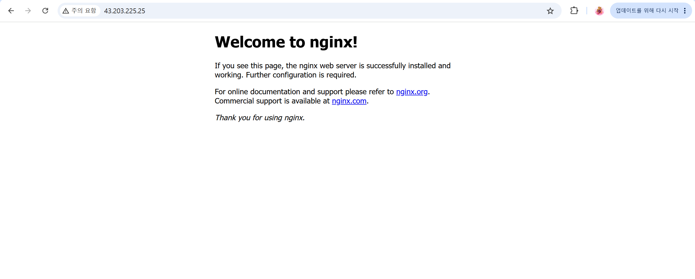

# 평가 요소별 설명

첨부한 평가문항의 항목 1~5에 맞춰 실제 실습 결과, 구성 이유, 문제 발생 시 대응 방법을 정리했다. **실제 수행**은 2026-10-07 실습 기록과 증거를 기준으로 한다. **대응 방안**은 설명을 위한 절차이며 해당 장애나 확장을 실제로 수행했다는 의미는 아니다. PASS/FAIL 판정은 평가자가 수행한다.

실습 리소스는 이미 정리했다. 아래 IP와 구성은 배포 당시의 값이며, 외부 접속 성공은 당시 저장한 캡처로 확인한다.

## 항목 1. 필수 구성과 동작 확인

### 1-1. VPC·Public Subnet·IGW·Route Table 구성

**실제 수행:** 서울 리전 `ap-northeast-2`에 VPC `mission-vpc`(`10.0.0.0/16`)를 만들고, 그 안에 Public Subnet `mission-public`(`10.0.1.0/24`, `ap-northeast-2a`)을 구성했다. 인터넷 게이트웨이 `mission-igw`를 VPC에 연결하고, 서브넷에 연결된 `mission-public-rt`에 `0.0.0.0/0 → mission-igw` 경로를 설정했다. EC2에는 퍼블릭 IPv4 `43.203.225.25`가 할당됐다.

이 구성에서 서브넷의 인터넷 경로, EC2의 퍼블릭 IP, 보안 그룹의 허용 규칙이 함께 있어야 인터넷과 통신할 수 있다. 이름에 public을 붙이는 것만으로 인터넷 접근이 가능해지는 것은 아니다. [AWS 인터넷 게이트웨이 설명](https://docs.aws.amazon.com/vpc/latest/userguide/VPC_Internet_Gateway.html)

**근거:** [README 네트워크 구성](../README.md#2-네트워크-구성), 아래 아키텍처, 외부 브라우저 접속 및 서버의 외부 요청 성공 캡처. 정리할 때 기록한 리소스 ID도 [정리 체크리스트](cleanup-checklist.md)에 남겼다.



### 1-2. EC2 SSH 접속과 웹 서버 실행

**실제 수행:** `mission-web`(`t3.micro`, Ubuntu)에 SSH로 접속했다. 서버 프롬프트 `ubuntu@ip-10-0-1-100:~$`를 확인한 뒤 Nginx를 설치하고 실행했다. `systemctl is-active nginx`는 `active`, `curl -I http://localhost`는 `HTTP/1.1 200 OK`를 반환했다. `curl -I https://example.com`도 `HTTP/2 200`을 반환해 서버의 인터넷 아웃바운드를 확인했다.

**근거:** 다음 원본 캡처에서 로그인 프롬프트, 실행 상태, 두 HTTP 응답을 확인할 수 있다.



### 1-3. 필요한 인바운드 포트와 SSH 특정 IP 제한

**실제 수행:** EC2에 연결한 `mission-web-sg`의 인바운드는 다음 두 규칙으로 구성했다.

| 용도 | 프로토콜 / 포트 | 소스 | 설정 이유 |
|---|---|---|---|
| 공개 웹 페이지 | TCP 80 | `0.0.0.0/0` | 외부 브라우저의 HTTP 접속 허용 |
| 서버 관리 | TCP 22 | `210.108.18.229/32` | 실습 PC의 공인 IP 한 개에서 SSH 접속 허용 |

HTTPS 서버와 DB를 구성하지 않았으므로 443, 3306, 5432 등의 인바운드를 추가하지 않았다. 초기 설정에서 SSH 소스를 전체 IPv4로 선택했던 부분은 배포 전에 내 IP로 변경했다. 보안 그룹은 허용 규칙을 추가하는 방식이므로 허용하지 않은 인바운드는 기본적으로 통과하지 않는다. [AWS 보안 그룹 규칙](https://docs.aws.amazon.com/vpc/latest/userguide/security-group-rules.html)

**근거:** [README 보안과 권한](../README.md#3-보안과-권한)과 아래 원본 캡처. 2026-10-07 14:42에 저장한 EC2 생성 시 설정 화면에서 SSH 22의 `/32` 제한과 HTTP 80의 전체 IPv4 허용을 확인할 수 있다. 로컬 PC의 SSH 접속과 외부 HTTP 접속도 확인했다.



### 1-4. 외부 접속 검증 방식 A 또는 B

**선택한 방식은 A: 브라우저 접속이다.** 로컬 PC의 브라우저에서 `http://43.203.225.25`를 열었고 `Welcome to nginx!` 페이지가 정상적으로 표시됐다. 퍼블릭 IP와 HTTP 80 허용 규칙, 실행 중인 Nginx를 구성해 이 검증이 가능하도록 했다.

localhost의 200 응답은 서버 내부 동작을 확인하는 자료이고, 아래 브라우저 화면은 외부 접근을 확인하는 자료다. B 방식의 `GET /health` 고정 응답은 구현하지 않았다. 평가 조건은 A 또는 B 중 하나이므로 이번 실습은 A를 증거로 제출한다.



### 1-5. 최소 5종 리소스 정리 확인

**실제 수행:** EC2·EBS·EIP·IGW·VPC를 각각 확인하고 결과를 기록했다. EIP는 별도 할당한 주소가 없어 릴리스할 대상이 없었다.

| 평가 대상 | 확인한 결과 | 증거 |
|---|---|---|
| EC2 | `i-0eea7fc0ae794a282` 상태가 종료됨 | [EC2 종료 캡처](cleanup-ec2-terminated.png) |
| EBS | `vol-06042cc7766bda9e0` 검색 결과 없음 | [EBS 잔여 없음 캡처](cleanup-ebs-absent.png) |
| EIP | 해당 리전의 필터 없는 목록에 주소 없음 | [EIP 목록 캡처](cleanup-eip-absent.png) |
| IGW | `igw-0961d935789a435aa` 삭제 성공 목록에 표시 | [네트워크 삭제 상세](cleanup-network-deleted.png) |
| VPC | `vpc-02fb9f982bc0efd7c` 삭제 성공 | [VPC 삭제 캡처](cleanup-vpc-deleted.png) |

서브넷, 라우팅 테이블, 보안 그룹, 키페어도 삭제했다. NAT Gateway·로드 밸런서·RDS 목록이 비어 있음을 사용자가 추가 확인했으며, 이 세 목록의 별도 캡처는 없다. 전체 순서와 증거는 [정리 체크리스트](cleanup-checklist.md)에 첨부했다.

## 항목 2. 구성과 선택 이유 설명

### 2-1. 외부 → IGW → Subnet → EC2 흐름

아키텍처의 외부 클라이언트는 EC2의 퍼블릭 IP로 HTTP 요청을 보낸다. VPC에 연결된 IGW가 인터넷과 VPC 사이의 통신을 제공하고, 요청은 Public Subnet에 있는 EC2의 네트워크 인터페이스로 전달된다. 연결된 보안 그룹에서 TCP 80 요청이 허용되면 Nginx가 요청을 받아 페이지를 응답한다.

응답이 인터넷으로 돌아갈 때는 서브넷에 연결된 라우팅 테이블의 기본 경로가 사용된다. 라우팅 테이블은 패킷이 방문하는 서버가 아니라 목적지에 따라 보낼 경로를 결정하는 설정이다. [AWS 인터넷 게이트웨이와 라우팅](https://docs.aws.amazon.com/vpc/latest/userguide/VPC_Internet_Gateway.html)

### 2-2. 보안 그룹 규칙 최소화 기준

판단 기준은 **공개해야 하는 기능과 관리자가 사용하는 기능**이다. HTTP 페이지는 누구나 볼 수 있어야 하므로 80을 전체 IPv4에 허용했다. SSH는 서버 관리용이므로 22를 실습 PC IP 한 개에만 허용했다. `/32`는 단일 IPv4 주소를 의미한다. 사용하지 않는 웹·DB·개발 서버 포트는 추가하지 않았다. [AWS 포트와 소스 지정](https://docs.aws.amazon.com/vpc/latest/userguide/security-group-rules.html)

이는 인바운드 최소화 기준이다. 서버에서 패키지를 설치하고 외부 HTTPS 요청을 보내는 아웃바운드까지 두 포트만 허용했다는 의미는 아니다.

### 2-3. 외부 검증 방식 선택과 구성

별도 애플리케이션 없이 Nginx 페이지로 웹 서버 배포를 확인할 수 있어 A 방식을 선택했다. Public Subnet의 인터넷 경로를 설정하고, EC2의 퍼블릭 IP를 확보하고, 보안 그룹에서 HTTP 80을 허용한 뒤 Nginx를 실행했다. 마지막으로 외부 PC 브라우저에서 접속해 주소창과 페이지를 함께 캡처했다.

이 방법은 요청이 실제 서버까지 도달하는지 확인하는 데 적합하다. 애플리케이션이나 DB의 세부 상태까지 확인하려면 별도로 상태 확인 API를 설계해야 한다.

### 2-4. 실습 리소스 추적과 정리 기준

실제 사용한 기준은 **`mission-` 이름 규칙, 리소스 ID, 서울 리전, 정리 체크리스트**다. VPC는 `mission-vpc`, 서버는 `mission-web`, 서브넷은 `mission-public`, IGW는 `mission-igw`로 이름을 맞췄다. 이름으로 대상을 찾은 뒤 정확한 ID로 확인했고, EBS는 인스턴스의 스토리지 탭에서 연결된 볼륨 ID를 먼저 기록했다.

체크리스트는 확인한 뒤에만 완료로 표시했으며, 실제 삭제 성공 메시지나 목록에 대상이 없는 화면을 첨부했다. 모든 리소스에 별도 `Project` 태그를 붙였다는 기록은 없다. 향후 반복 실습에서는 이름 규칙에 더해 `Project`, `Owner`, `Environment` 태그를 적용해 추적하기 쉽게 할 수 있다.

## 항목 3. 네트워크·보안·검증 원리

### 3-1. Public Subnet에 기본 경로가 필요한 이유

`0.0.0.0/0`은 다른 더 구체적인 경로와 일치하지 않는 IPv4 목적지에 사용하는 기본 경로다. VPC 내부 목적지는 `10.0.0.0/16 → local`로 처리하고, 인터넷 목적지는 `0.0.0.0/0 → IGW`로 보내도록 구성했다. 기본 경로가 없다면 EC2에 퍼블릭 IP가 있어도 서브넷의 라우팅 설정만으로 인터넷 목적지에 도달할 수 없다. IGW 연결, 퍼블릭 IP, 보안 그룹 설정도 함께 필요하다. [AWS 인터넷 연결 조건](https://docs.aws.amazon.com/vpc/latest/userguide/VPC_Internet_Gateway.html)

### 3-2. Security Group과 IAM의 차이 및 최소 권한

| 구분 | 제어하는 대상 | 실습 예시 |
|---|---|---|
| Security Group | 연결된 리소스의 네트워크 통신 | EC2의 HTTP 80 및 SSH 22 접근 |
| IAM | 사용자·역할이 수행하는 AWS API 작업 | VPC 생성, EC2 시작·종료, 리소스 삭제 |

IAM 권한이 있어도 보안 그룹에서 막힌 SSH 연결은 통과하지 않는다. 반대로 HTTP가 열려 있어도 방문자에게 AWS 리소스를 삭제할 IAM 권한이 생기지는 않는다. 최소 권한은 계정이나 자격 증명이 오용됐을 때 가능한 작업과 피해 범위를 줄이기 위해 필요하다. [AWS IAM 정책과 권한](https://docs.aws.amazon.com/IAM/latest/UserGuide/access_policies.html)

실습 사용자 `cloud-lab`에는 `AdministratorAccess` 대신 [CloudLabSeoulPolicy](iam-policy.json)를 연결했다. 생성·변경·삭제 작업을 서울 리전으로 제한하고, 실행할 인스턴스 유형을 micro로 제한했으며 필요한 EC2/VPC 작업을 명시했다. 조회용 `ec2:Describe*`에는 리전 제한이 없다. 또한 리소스가 `*`이므로 특정 실습 ID에만 접근하는 수준까지 제한한 정책은 아니다. 실제 정책의 한계를 기록하고, 추가로 줄인다면 작업별 ARN 지원 여부를 확인해 리소스와 조건을 좁힌다.

### 3-3. SSH·DB 포트를 전체 IPv4에 열지 않는 이유와 대안

관리용 SSH나 DB 포트를 `0.0.0.0/0`에 허용하면 인터넷의 불특정 호스트가 해당 포트로 연결을 시도할 수 있다. 계정 공격, 취약점 탐색, 설정 실수에 대한 노출 범위가 커진다. 이번 실습은 SSH 소스를 내 공인 IP `/32`로 제한했다.

DB를 추가한다면 Private Subnet에 두고 DB 포트의 소스를 애플리케이션 서버의 보안 그룹으로 지정하는 방법을 검토한다. 관리 접속에는 VPN이나 Session Manager를 사용할 수도 있다. 이 대안들은 이번 실습에 구축한 구성은 아니다. DB 포트에 보안 그룹을 소스로 지정하는 방식은 AWS의 웹·DB 분리 예시와 같다. [AWS 보안 그룹 참조 예시](https://docs.aws.amazon.com/vpc/latest/userguide/security-group-rules.html)

### 3-4. 가설 → 검증 순서를 유지한 이유와 활용한 근거

추측만으로 설정을 바꾸면 원인을 확인하기 어렵고 불필요한 변경이 늘어난다. 따라서 증상에서 가설을 세운 뒤 현재 환경과 오류 메시지로 검증하고, 필요한 조치를 한 뒤 결과를 다시 확인했다.

실제 사례에서는 Ubuntu에 이미 로그인한 상태에서 Windows용 SSH 명령을 다시 실행해 키 파일을 찾지 못했다. 처음에는 파일 위치 문제처럼 보였지만, Ubuntu 프롬프트와 `$env`가 사라진 경고 경로를 확인해 실행 환경이 다르다는 가설을 검증했다. 서버 작업을 이어가 Nginx의 `active`, localhost 200, 외부 요청 200, 브라우저 화면으로 최종 결과를 확인했다.

근거는 터미널의 오류 출력, 로그인 프롬프트, 서비스 상태, HTTP 응답, 원본 캡처였다. 이 사례에서 Nginx 로그 파일이나 CloudTrail을 읽어 원인을 확인했다는 기록은 없다. Windows의 최초 `ssh` 인식 실패도 32비트 셸 때문이라고 확정하지 않았다. 자세한 가설·검증·조치 기록은 [트러블슈팅 보고서](troubleshooting.md)에 있다.

## 항목 4. 문제 발생과 확장 상황의 대응 방안

아래 네 항목은 평가 질문에 대한 **대응 방안**이다. 실제로 외부 접속 장애, IAM API 거부, 부하 증가 또는 예상치 못한 청구를 경험하고 해결했다는 기록은 아니다.

### 4-1. 외부 접속 실패 시 점검 순서

평가표의 **라우팅 → SG → 퍼블릭 IP/DNS → 서버 프로세스/로그** 순서로 각 단계의 정상 조건을 확인한다.

| 순서 | 확인할 내용 | 문제가 있으면 수행할 조치 |
|---|---|---|
| 1. 라우팅 | EC2 서브넷에 연결된 Route Table, `0.0.0.0/0 → IGW`, IGW의 VPC 연결 | 올바른 테이블 연결 및 기본 경로 수정 |
| 2. SG | EC2에 실제 연결된 모든 SG의 TCP 80 소스, SSH라면 22와 현재 공인 IP | 필요한 포트와 소스만 추가·수정 |
| 3. 퍼블릭 IP/DNS | EC2 현재 퍼블릭 IP와 브라우저 주소 일치, 도메인이 있다면 DNS 해석 | 현재 IP 사용 또는 도메인 레코드 수정 |
| 4. 서버 | Nginx 실행, 80 포트 리스닝, localhost 응답, 오류 로그 | 결과에 따라 서비스 실행 또는 설정 수정 |

마지막 단계에서는 다음 명령을 사용한다. 아래는 진단용 예시이며 새로 실행한 결과는 아니다.

```bash
systemctl is-active nginx
sudo ss -lntp
curl -I http://localhost
sudo nginx -t
sudo journalctl -u nginx --no-pager -n 50
sudo tail -n 50 /var/log/nginx/error.log
sudo tail -n 50 /var/log/nginx/access.log
```

localhost도 실패하면 서버 측 상태를 먼저 해결한다. localhost는 정상인데 외부 연결이 실패하면 네트워크·주소 설정을 다시 확인하고, 필요하면 Network ACL과 OS 방화벽까지 범위를 넓힌다. timeout, connection refused, HTTP 403/404/500처럼 실패 형태도 기록해 다음 가설을 좁힌다.

### 4-2. IAM 권한 부족 시 필요한 최소 범위 찾기

먼저 오류의 `AccessDenied` 또는 `UnauthorizedOperation`, 요청 사용자·역할, 거부된 작업, 대상 리소스, 리전을 기록한다. 현재 정책의 Action·Resource·Condition과 비교한 뒤 해당 서비스의 권한 문서에서 필요한 작업 및 종속 권한을 확인한다. 권한 경계나 조직 정책의 명시적 거부가 있다면 Allow 추가만으로 해결되지 않는지도 점검한다. [AWS 권한 거부 진단](https://docs.aws.amazon.com/IAM/latest/UserGuide/troubleshoot_access-denied.html)

예를 들어 서울 리전의 인스턴스 종료가 실패했다면 `ec2:TerminateInstances`와 그 대상·조건부터 확인한다. 원인을 검증한 뒤 필요한 범위만 수정하고 같은 작업을 재시도한다. 실패했다는 이유만으로 `AdministratorAccess`를 연결하지 않는다.

이번 실습의 사용자에는 Billing 조회 권한을 넣지 않았고, 비용 확인은 루트 계정으로 수행했다. 이를 `cloud-lab` 정책에 청구 관리 권한을 추가해 해결했다고 기록하지 않는다.

### 4-3. 트래픽 증가로 인스턴스를 2대로 늘릴 경우

현재 구성은 단일 `t3.micro` EC2와 단일 가용 영역이다. 모든 요청이 서버 한 대에 집중되고 해당 서버가 장애 지점이 된다. 다만 실제 부하 측정을 수행하지 않았으므로 CPU·메모리·네트워크 중 어느 자원이 먼저 병목인지 확정할 수 없다. 응답 시간, 요청량, CPU, 메모리, 네트워크 및 웹 로그를 측정해 판단한다.

웹 서버 처리 용량을 늘린다면 EC2 두 대를 Target Group에 등록하고 ALB가 요청을 분산하도록 설계한다. ALB에는 리스너와 상태 확인을 설정해 정상 서버로 요청을 전달하게 한다. ALB의 역할은 요청 분산이며, 서버 두 대가 있다고 애플리케이션 데이터까지 자동으로 공유되는 것은 아니다. [AWS ALB 동작](https://docs.aws.amazon.com/elasticloadbalancing/latest/application/introduction.html)

일반적인 리전 ALB를 구성하려면 서로 다른 가용 영역의 서브넷 두 개 이상이 필요하므로 현재 단일 서브넷 구조를 확장한다. 장애 분산을 위해 두 EC2도 가용 영역을 나누는 구성을 검토한다. 외부는 ALB의 DNS 이름으로 접속하고, 서버 HTTP 인바운드의 소스는 ALB 보안 그룹으로 제한한다. 상태를 저장하는 서비스라면 세션·파일 저장을 공용 저장소로 분리하고, 자동 증감이 필요하면 Auto Scaling도 검토한다. [AWS ALB 서브넷 구성](https://docs.aws.amazon.com/elasticloadbalancing/latest/application/application-load-balancers.html), [AWS 보안 그룹 연결 예시](https://docs.aws.amazon.com/vpc/latest/userguide/security-group-rules.html)

ALB, 두 번째 EC2, 추가 서브넷, Auto Scaling은 이번 실습에 배포하지 않았다.

### 4-4. Billing에서 예상치 못한 비용이 보일 경우

먼저 청구서와 Cost Explorer에서 **기간 → 서비스 → 리전 → 사용 유형**으로 비용 범위를 좁힌다. 예상 비용, 발생한 사용 비용, 크레딧 적용 후 금액을 구분한다. 청구 데이터는 즉시 반영되지 않을 수 있어 비용 화면과 실제 리소스 상태를 함께 확인한다. [AWS Cost Explorer 분석](https://docs.aws.amazon.com/cost-management/latest/userguide/ce-exploring-data.html)

이번 구성과 관련해 우선 확인할 대상은 실행 중인 EC2, 종료 후 남은 EBS, 별도 할당한 EIP 및 퍼블릭 IPv4 관련 사용이다. 이어 NAT Gateway, 로드 밸런서, RDS, 스냅샷·데이터 전송 등 비용 내역에 나타난 항목을 확인한다. 실습 이름·ID·태그·리전과 대조해 소유한 실습 리소스를 식별하고, 삭제 전에 필요한 데이터를 보관한 뒤 종료·삭제·주소 릴리스 등 해당 유형에 맞는 정리를 수행한다. 종료 상태와 목록을 확인한 후 비용 데이터가 갱신되면 다시 비교한다.

실제 확인한 금액은 2026-10-07의 계정 크레딧 잔액 US$119.97 및 누적 사용 US$0.03이다. 이번 실습 단독 비용으로 확정할 수 없으며, 당시 월별 비용 화면은 데이터 준비 중이었다. 2026-10-08 작성 시점에도 새 비용 화면을 확인했다는 기록은 없다. 기존 캡처와 리소스 정리 근거는 [정리 체크리스트](cleanup-checklist.md)에 있다.

## 항목 5. 보너스 문제

이번 실습에서는 HTTPS와 Docker 보너스 과제를 수행하지 않았다. HTTP Nginx 페이지로 기본 요구사항을 검증했다. 서버에서 `https://example.com`으로 요청한 것은 외부 HTTPS 사이트로 나가는 통신 확인이며, 내 서버에 HTTPS를 구성했다는 증거가 아니다. 보너스 크레딧의 부여 여부는 평가자가 결정한다.
