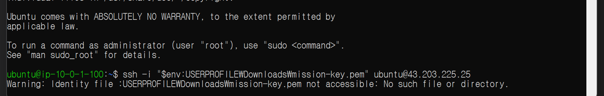

# SSH 접속 오류와 실행 환경 구분

## 사례 1 Ubuntu 서버에서 Windows용 접속 명령 실행

### 증상

SSH 로그인 후 `ubuntu@ip-10-0-1-100:~$` 프롬프트가 표시된 상태에서 Windows PowerShell용 접속 명령을 다시 입력했다.

```text
ssh -i "$env:USERPROFILE\Downloads\mission-key.pem" ubuntu@43.203.225.25
Warning: Identity file :USERPROFILE\Downloads\mission-key.pem not accessible:
No such file or directory.
```

오류 당시 원본 화면(2026-10-07 15:43 저장): Ubuntu 프롬프트와 키 파일 경로 경고를 확인할 수 있다.



### 원인 가설

현재 터미널은 이미 EC2의 Ubuntu 셸이다. `$env:USERPROFILE`은 Windows PowerShell의 환경 변수 표기이며, Ubuntu 셸에서는 같은 의미로 해석되지 않는다. 로컬 PC의 다운로드 폴더 경로를 서버에서 그대로 사용할 수도 없다.

### 검증

- 프롬프트의 `ubuntu@ip-10-0-1-100`을 확인해 현재 실행 환경이 EC2 서버임을 확인했다.
- 경고에 표시된 경로에서 `$env` 부분이 사라지고 `:USERPROFILE`이 남아 있었다.
- 따라서 추가 SSH 실행 전에 외부 PC에서 EC2로의 접속은 이미 완료된 상태였다.

### 조치

이미 접속된 Ubuntu 화면에서 추가 SSH 명령을 중단하고, 서버 작업을 이어가는 절차로 진행했다. 명령 실행 대기 중일 때는 `Ctrl+C`로 중단한다. 이후 Nginx를 설치·실행하고 서버 내부 및 외부 접속을 검증했다.

```bash
sudo apt update
sudo apt install -y nginx curl
sudo systemctl enable --now nginx
systemctl is-active nginx
curl -I http://localhost
curl -I https://example.com
```

### 결과

- Nginx 상태: `active`.
- localhost 응답: `HTTP/1.1 200 OK`.
- example.com 응답: `HTTP/2 200`.
- 로컬 브라우저에서 `http://43.203.225.25` 접속 후 `Welcome to nginx!` 확인.

조치 후 서버 검증 화면(2026-10-07 15:49 저장): Nginx 실행 상태와 두 HTTP 200 응답이 표시된다.


외부 브라우저 접속 화면(2026-10-07 15:46 저장): 퍼블릭 IP 주소와 Nginx 페이지가 함께 표시된다.


세 이미지는 실제 실습 중 저장한 원본 캡처이며, 수정하지 않고 증빙으로 보관했다.

### 재발 방지

명령을 입력하기 전에 프롬프트를 확인한다.

| 프롬프트 | 실행 위치 | 수행할 작업 |
|---|---|---|
| `PS C:\Users\user>` | Windows PC의 PowerShell | 키 파일을 이용한 SSH 접속 |
| `ubuntu@ip-10-0-1-100:~$` | EC2 Ubuntu 서버 | 패키지 설치, Nginx 운영, curl 검증 |

AWS 로그인에 사용하는 IAM 사용자 `cloud-lab`과 서버 OS 로그인 사용자 `ubuntu`도 구분한다.

## 사례 2 Windows의 SSH 명령 인식 실패와 설치 권한 오류

처음 Windows PowerShell에서 `ssh` 명령이 프로그램으로 인식되지 않았다. 클라이언트 미설치 또는 실행 경로 누락을 가설로 두었다. 이어 시스템 경로를 지정한 실행도 사용자 환경에서 실패했다. 이 기록만으로 32비트 PowerShell이 원인이라고 확정하지 않는다.

OpenSSH 클라이언트 설치 명령을 일반 PowerShell에서 실행했을 때는 다음 오류가 발생했다.

```text
Add-WindowsCapability : 요청한 작업을 수행하려면 권한 상승이 필요합니다.
```

관리자 권한으로 PowerShell을 열고 다음 설치 명령을 실행하는 복구 절차를 안내했다.

```powershell
Add-WindowsCapability -Online -Name OpenSSH.Client~~~~0.0.1.0
```

그 뒤 사용자가 공유한 화면에서 EC2 Ubuntu 로그인 프롬프트를 확인했다. 설치 완료 출력 자체는 제출 기록에 포함하지 않았으므로, 확인된 최종 결과는 SSH 로그인 성공이다. 같은 오류가 재발하면 현재 PC에서 클라이언트 설치 상태와 명령 경로를 먼저 확인하고, 설치 작업은 관리자 PowerShell에서 수행한다.
